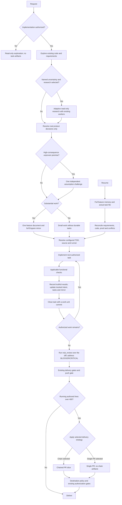

# Referencia técnica de Nub-IA

Nub-IA es la shell de coding-agent del equipo de Nubiral, construida sobre [Pi](https://pi.dev). Es un fork de [gentle-shell](https://github.com/Gentleman-Programming/gentle-shell) (paquete `gentle-pi`, MIT) con la identidad y la configuración del equipo. Esta página es la referencia operativa; para el panorama general empezá por el [README](../README.md) y para la experiencia de la terminal por [La shell de Nub-IA](nub-ia-shell.md).

## Índice

- [Instalación y launcher](#instalación-y-launcher)
- [Comandos `/nubia:*`](#comandos-nubia)
- [Organic Driven Development](#organic-driven-development)
- [Subagentes y delegación](#subagentes-y-delegación)
- [Review 4R y gate de push](#review-4r-nub_review-y-gate-de-push)
- [Router de modelos y tiers](#router-de-modelos-y-tiers)
- [Perfiles y pins](#perfiles-y-pins)
- [Persona](#persona)
- [Guardrails y YOLO](#guardrails-y-yolo)
- [Edición de prompt, Esc y animaciones](#edición-de-prompt-esc-y-animaciones)
- [RTK](#rtk-menos-tokens-por-comando)
- [Paquetes del equipo y skills](#paquetes-del-equipo-y-skills)
- [Variables de entorno](#variables-de-entorno)
- [Resolución de problemas](#resolución-de-problemas)

## Instalación y launcher

Requisitos: Node >= 22.19, pnpm 11 y Pi. Nub-IA se instala desde Git (es `private: true`, no se publica en npm):

```bash
git clone <URL-DEL-REPO> nub-ia && cd nub-ia
pnpm install          # el postinstall descarga el binario rtk pinneado
pnpm link --global    # expone el comando `nub-ia`
nub-ia                # primera ejecución: provisiona ~/.nub-ia/agent
```

El comando `nub-ia` (`bin/nub-ia.mjs`, envoltorio de `lib/nubia-launcher.ts`) abre Pi con el paquete cargado sin tocar tu instalación de Pi.

```text
nub-ia [opciones] [-- pi-args...]
nub-ia home [link|isolated|<path>]
nub-ia [selector de home] setup [--dry-run]
nub-ia install npm:<pkg> | remove <source> | list | update [target] | config | auth <cmd>
```

| Opción | Efecto |
| --- | --- |
| `--link` | Usa tu home de Pi existente (`PI_CODING_AGENT_DIR` o `~/.pi/agent`): sesiones, logins y modelos. Nunca escribe su `settings.json`. |
| `--isolated` | Usa el home dedicado `NUB_IA_HOME` o `~/.nub-ia/agent` (por defecto). No copia credenciales: hace falta `/login` una vez. |
| `--home <path>` | Usa un directorio de home propio. |
| `--package-root <dir>` | Fuerza el directorio del paquete a cargar, por encima de cualquier paquete en conflicto que declare el `settings.json`. |
| `--help`, `-h` / `--version` | Ayuda completa / versiones de `nub-ia`, `pi` y home. |
| `--` | Todo lo que sigue se pasa a Pi tal cual. |

`--link`, `--isolated` y `--home` son excluyentes. Precedencia del home: flag explícito, luego la elección persistida con `nub-ia home`, luego `--isolated`. `nub-ia home link|isolated|<path>` persiste la elección en `~/.nub-ia/config.json`; `nub-ia home` solo imprime la vigente. Cualquier argumento desconocido (`--mode rpc`, `-p "..."`) se reenvía a Pi.

**Home aislado vs `--link`.** El aislado arranca con `tuiMode: fullscreen`, el tema `Nub-IA`, `defaultProvider: nub-ia` / `defaultModel: balanced`, y un marcador de propiedad `.nub-ia-home`. Es el único donde el launcher provisiona paquetes automáticamente. `--link` reutiliza lo que ya tenés y nunca se provisiona: instalá los paquetes a mano con `nub-ia --link install <source>`.

**`setup`.** `nub-ia setup` instala en el home los paquetes de `TEAM_PACKAGE_SOURCES` que todavía no declare (vía `pi install`). `--dry-run` solo informa. Corre solo en el primer arranque de un home propio y luego cuando cambia la lista; un fallo nunca bloquea el arranque y se reintenta en la siguiente ejecución. Un lock `<home>/.nub-ia-setup.lock` serializa primeras ejecuciones concurrentes (se considera vencido a los 15 minutos). `NUB_IA_NO_AUTO_SETUP=1` lo desactiva.

**Resolución del runtime de Pi:** 1) `NUB_IA_PI`; 2) `@earendil-works/pi-coding-agent` resuelto junto al paquete (peer opcional); 3) `pi` en el `PATH`. La versión mínima exigida es 0.99.1.

**Compatibilidad con Pi.** The current package requires Pi 0.99.1 or newer and Node >=22.19.0. Development tests resolve Pi through the open `>=1.0.0` development range. The private Vim editor adapter admits only the audited Pi `0.99.1`, `0.99.2`, and `1.0.0` releases; any other release keeps ordinary prompt editing until its editor is audited. Los procesos hijo (incluido cualquier override `NUB_IA_AGENTS_PI`) deben emitir `agent_settled`: `agent_end` registra la salida de una corrida pero no es la finalización, porque pueden seguir reintentos o continuaciones encoladas. Nub-IA no actualiza tu Pi instalado.

## Comandos `/nubia:*`

| Comando | Qué hace |
| --- | --- |
| `/nubia:status` | Estado del paquete: assets, configuración de modelos. |
| `/nubia:doctor` | Diagnóstico de solo lectura: assets, config de modelos/persona, herramientas, guardrails. |
| `/nubia:models` | Asigna modelo y esfuerzo por agente (`x` exporta, `r` restaura, `u` guarda y captura en el perfil activo). |
| `/nubia:profiles` | Perfiles de routing con nombre: aplicar, crear, snapshot, duplicar, renombrar, borrar, exportar/importar y pins por repo. |
| `/nubia:persona` | Alterna `gentleman` / `neutral`. |
| `/nubia:yolo [enable\|disable\|status]` | Permiso YOLO solo de sesión (ver [yolo-mode.md](yolo-mode.md)). |
| `/nubia:background-subagents [enable\|disable]` | Política de subagentes en background. |
| `/nubia:install-delegation`, `/nubia:install-review` (`--force`) | Reparan/refrescan los agentes globales de delegación y de review. |
| `/nubia:agents` (`alt+a`) | Overlay de subagentes. |
| `/nubia:changes` (`alt+g`) | Cambios capturados de la sesión. |
| `/nubia:commands` (`alt+k`) | Paleta de comandos curada. |
| `/nubia:usage`, `/nubia:stats` | Uso de suscripciones / historial local de uso. |
| `/nubia:customize` | Apariencia, Vim, YOLO, captura de historial de prompts. |
| `/nubia:banner`, `/nubia:toggle-rose`, `/nubia:toggle-text-logo`, `/nubia:banner-color` | Banner de inicio (ver [la shell](nub-ia-shell.md#personalización)). |
| `/nubia:animations`, `/nubia:vim`, `/nubia:double-esc-cancel` | Animaciones, edición modal, doble Esc (ver más abajo). |
| `/nubia:review [staged\|working\|<ref>]` | Review 4R en proceso. |
| `/skill-registry:refresh` | Regenera `.atl/skill-registry.md`. |
| `/skill-creation` | Crea o actualiza una skill LLM-first con el [style guide](skill-style-guide.md). |

Al iniciar, el paquete instala y refresca solo los agentes de delegación y review con hash probado; los archivos editados por el usuario y los overrides de proyecto no se tocan. Estado y doctor señalan assets faltantes o desactualizados y el comando de reparación.

## Organic Driven Development

Organic Driven Development (ODD) keeps explore → implement → proportionate checks as the development workflow. For large authorized implementation (its resume test fails), the parent automatically tracks feature progress after exploration, without asking for task-tracking or storage permission. Small, understood work creates no durable task artifact; investigation and proposal-only work stay read-only.

### The ODD protocol

ODD runs on every request, without the user asking for a workflow, a plan, or task tracking.

1. **Authorize** — read-only unless implementation is authorized; ask one clarification when intent is ambiguous.
2. **Explore** — read existing code and requirements first, proportionately to the request.
3. **Resolve uncertainty** — optional research or one focused product question only for a real unresolved decision.
4. **Classify** — by the Task Size section: small when understood, risk is contained, and the work could be resumed from the request plus `git diff`; large only when that resume test fails. Counts never classify.
5. **Track before the first write** — create the feature document and Engram mirror automatically for large work, and tell the user in one line.
6. **Implement task by task** — route each task through the smallest safe workflow, with configured TDD and applicable checks. Every task closes with at least one work-unit commit on the feature branch (branch first when on the default branch), with tests and docs alongside the behavior, using a Conventional Commit message; the feature document records the commit identity as evidence.
7. **Close** — report the verified outcome, failed/pending checks, and the next step.

- **One feature document:** `odd/tasks/<feature-name>.md` holds objective, problem, why, scope, constraints, actionable checklist with stable IDs and acceptance criteria, verification evidence, progress, and next step. Project-scoped Engram topic `odd/<feature-name>/tasks` mirrors the full document and repository-relative locator. Keep concise rationale for meaningful accepted changes here, not a separate plan or exhaustive journal. Accepted user, review, or verification changes update intent and tasks together; preserve valid completed work, add new tasks or reopen invalidated items with reasons. Findings alone do not authorize expansion or acceptance. Routine corrections stay with their tasks; checkoffs require observed proof.
- **Recovery:** write local progress first and read back both copies; writes are not atomic. Unavailable Engram leaves an explicit pending mirror, not invented success or a block on unrelated safe work. Before implementation or resume, the parent reads full feature memory and the actual task file, reconciles code and evidence, and preserves conflicting versions. Pass the locator and relevant context; workers read the document before edits. The existing Todo UI is a projection, not another authority.
- **Task size:** about 400 authored changed lines (additions plus deletions) is advisory only, not a cap, acceptance criterion, automatic stop, or forced split. Keep coherent behavior with tests and docs, explain natural overages, and continue under existing PR policy. Forward this instruction to workers; never remove whitespace, comments, or tests, minify, invent abstractions, or split artificially for cosmetic savings.
- **Delegation boundary:** the parent delegates a writer for tracked tasks only for a reason (parallel units or context), never for size, file count, or a price ratio, and a second direct path alone is not a runtime refusal. The runtime cannot infer whether an edit is mechanical from write history. Validate consequential premises before building, reuse relevant sibling findings, run focused checks while iterating, then the applicable full suite at closure. This is effort guidance, not a hard token or line budget.
- **Research:** optional research addresses a named uncertainty. Establish problem, intended outcome, constraints, and current evidence; inspect code and adapt depth to consequence, not fixed questionnaires or rounds. The parent asks one focused product question only when needed, then waits; workers return gaps. Use available authorized documentation/web tools, prefer primary sources, and attribute claims to URLs/code locations. Distinguish facts, assumptions, contradictions, freshness, and gaps; return a recommendation, tradeoffs, open questions, and implementation implications. Forward these instructions to a fresh general worker. Unavailable evidence pauses only unsafe dependent decisions. Research stays read-only; a brief proposal is needed only for a real decision.
- **Assumptions:** at most one scoped independent read-only challenge for a high-consequence unproven premise, including a small security-critical change. Deterministic failures need fixes, not debate.
- **TDD:** resolve on/off from existing project/session configuration or explicit user choice; retain source and exact runner in the feature document when present and forward all three on every implementation delegation, refreshing on resume. Test presence does not enable TDD. Enabled requires observed RED before implementation → GREEN → REFACTOR; disabled still requires ordinary functional checks. Unknown/conflicting mode or a missing runner needs only the clarification affecting the next action, never invented precedence or commands.
- **Checks:** functional checks run per task; a TODO checkbox never triggers a review cycle.
- **Delivery:** at feature-document creation, forecast authored changed lines (additions plus deletions, generated files excluded) from the task list, and keep a running count from work-unit commits. Choose one delivery strategy per feature: `ask-on-risk` (default), `auto-chain`, `single-pr`, or `exception-ok`. When the forecast or running count exceeds about 400 authored changed lines, apply the chosen strategy before the next commit. `ask-on-risk` asks once using the ordered oversized-delivery menu; `auto-chain` asks only for a missing chain strategy and slices automatically with a cached choice. When either chaining path needs a choice, offer exactly these three semantic outcomes:

1. **Feature/tracker branch chain** — `chain_strategy=feature-branch-chain`; integrate the feature after reviewing child slices.
2. **Verified default/main branch chain** — `chain_strategy=stacked-to-main`; land slices in order on the verified destination default branch, not an assumed name.
3. **One single PR — least recommended** — `delivery_strategy=single-pr`; review the entire oversized change together.

Generate the complete user-facing question and every option label, description, and recommendation marker in the active user's conversation language (English for an English user, Spanish for a Spanish user, etc.). Machine strategy tokens remain unchanged and untranslated. These English examples are illustrative and localizable, not mandatory copy.

The third choice overrides the pending chaining path: clear the chain choice as inapplicable and suppress later chain prompts. `single-pr` is not a `chain_strategy` token; do not automatically select `exception-ok`. Least recommended is scoped to the oversized menu: larger single PRs increase reviewer load, slow feedback, and couple rollback. A focused ≤400-line single PR remains reasonable. Follow the destination repository's documented contribution/size policy; `size:exception` is a Gentle-owned repository policy, not a universal label requirement. Do not request or add it for generic users unless the destination policy uses it; keep applicable maintainer acceptance and protected-label authorization gates. Single-PR output requires no tracker, child dependency diagram, or Chain Context. Choosing shape does not authorize push, PR creation, or merge. Cache both choices, and record slice boundaries (which commits each PR holds) in the feature document for chains, or the whole-PR scope for single PR. Resolve the `work-unit-commits` and `chained-pr` skills by registry name before planning or creating any PR.



This is guidance through existing tools, not a new CLI, phase, state engine, or execution harness. Static prompt tests and scripted hook checks prove instruction delivery, not autonomous model adherence; actual create/update/resume behavior requires observed Pi sessions.

> **Nota.** El protocolo ODD de arriba se conserva en inglés porque es el contrato que el harness inyecta al orquestador y lo que verifican los tests del paquete. En castellano: ODD corre en cada pedido sin que lo pidas; explora, clasifica el tamaño (pequeño = se retoma con el pedido más `git diff`; grande = no), y solo para trabajo grande crea un documento de feature (`odd/tasks/<feature>.md`) con su copia en Engram. Cada tarea cierra con un commit de unidad de trabajo, y antes de entregar se corre `nub_review`.

## Subagentes y delegación

El orquestador mantiene la sesión delgada y delega en el punto más estrecho útil. Los agentes del paquete viven en `assets/agents/` y se instalan en el home:

| Agente | Rol | Tier |
| --- | --- | --- |
| `nubia-explore` | Mapeo de solo lectura; devuelve un handoff corto con evidencia `path:línea`. | `balanced` |
| `nubia-worker` | Un escritor acotado por tarea, con TDD y verificación según lo reenviado. | `balanced` |
| `nubia-verify` | Verificador independiente de solo lectura, para cambios de riesgo alto. | `balanced` |
| `review-risk`, `review-reliability`, `review-resilience`, `review-readability` | Los cuatro lentes de `nub_review`. | `strong` (risk) / `balanced` |
| `jd-judge-a`, `jd-judge-b`, `jd-fix-agent` | Judgment Day: dos jueces ciegos independientes y un agente de fixes (máximo dos rondas). | `strong-alt` / `strong` / `balanced` |

Disparadores: investigación que supera el presupuesto de evidencia (un lote paralelo de hasta 3 llamadas, ~10k tokens, o más de ~5 búsquedas secuenciales) → explorador read-only; tarea grande → se delega un writer solo por una razón (unidades paralelas o contexto), nunca por tamaño, cantidad de archivos ni ratio de precio; cambio de riesgo alto → verificador independiente después de los checks propios; contexto del padre pasado los ~150k tokens → delegar la siguiente unidad acotada. Trabajo chico: todo inline, con el test focalizado y la suite una vez cada uno.

`worker` corre un único hilo de escritura acotado; parallel writers only with disjoint Allowed edit surfaces (runtime-enforced) or isolated worktrees. "Runtime-enforced" significa un chequeo de admisión dentro de un proceso de Pi: `subagent_run` / `subagent_continue` rechaza a un writer si otro writer encolado o corriendo del mismo padre y worktree tiene una entrada de `## Allowed edit surfaces` superpuesta (el solapamiento es conservador: una entrada cubre todo lo que cuelga de ella; globs raros se consideran solapados con todo). No es una guardia de escritura: no impide que un writer edite fuera de sus superficies, y procesos de Pi distintos no se coordinan.

Herramientas: `subagent_list_agents`, `subagent_run` (`agent`, `task`, `mode` task|background, `workspace_root`/`repository_root`), `subagent_status`, `subagent_result`, `subagent_list_tasks`, `subagent_reply`, `subagent_cancel`, `subagent_send_message`, `subagent_continue`. Las definiciones son markdown en `~/.pi/agent/agents/`, `<cwd>/.pi/agents/` y las carpetas `subagents/` equivalentes (el proyecto gana). El overlay `/nubia:agents` y el esquema de actividad RPC están en [gentle-agents-activity.md](gentle-agents-activity.md); cómo se verifica el trabajo delegado, en [delegated-verification.md](delegated-verification.md).

**Background subagents.** Con la política `on`, `subagent_run` usa `mode: "background"` por defecto en sesiones interactivas/RPC; el resultado vuelve como mensaje `gentle-agents.result` y arranca un turno nuevo (el modelo no hace polling). En `pi -p` y `pi --mode json` siempre se usa `task`. Es `off` salvo que la actives con `/nubia:background-subagents enable`. Fuentes, primera que gana: `<cwd>/.pi/nub-ia/background-subagents.json` (proyecto), `<configHome>/background-subagents.json` (global), `NUB_IA_BACKGROUND_SUBAGENTS=on|off`, default `off`. Un archivo malformado falla cerrado a `off`. `configHome` es `NUB_IA_CONFIG_HOME` o, por defecto, `~/.pi/nub-ia` (ruta heredada del upstream).

### Cache warming nativo (Pi 0.86.1+)

Para permitir el warming mientras el padre espera resultados en background, configurá explícitamente `"cacheWarming": "idle"` en el `settings.json` de Pi (`~/.pi/agent/settings.json` o `.pi/settings.json`). Nub-IA nunca cambia esa opción. El modo nativo `"streaming"` se detiene cuando el agente termina: no idle decision is offered for this hook to override. `"off"` sigue siendo el opt-out. Con tareas en background del padre activo, la probabilidad de continuación se toma como 1, pero el ahorro estimado menos el costo del refresh debe ser al menos $0.05. La finalización es siempre push: retené el ID de la tarea, terminá el turno y no hagas sleep ni polling.

## Review 4R (`nub_review`) y gate de push

`extensions/nub-ia-review.ts` corre los cuatro revisores (risk, reliability, resilience, readability) en paralelo y en proceso sobre el diff actual, sin binarios externos. Consolida los hallazgos JSON en `.pi/nub-ia/reviews/<fecha>-<hash>.md` con veredicto `APPROVE | WARN | BLOCK | INCOMPLETE`.

- Herramienta `nub_review` (`scope: auto|staged|working`, o `baseRef` para un rango ya commiteado) y comando `/nubia:review [staged|working|<ref>]`.
- Los lentes usan los tiers del router: `review-risk` → `nub-ia/strong`, el resto `nub-ia/balanced`. Si un provider falla (503/429), ese lente se reintenta en el siguiente.
- **Gate de push:** antes de un `git push`, si los cambios no tienen review, el review fue de otro diff, o el veredicto fue BLOCK/INCOMPLETE, pide confirmación (sin UI, bloquea con el motivo). `NUB_IA_REVIEW_GATE=off` lo desactiva. Entregar sigue siendo decisión de quien pushea.
- Un review de código no reemplaza los checks funcionales aplicables (tests, build, verificación en navegador para UI).

## Router de modelos y tiers

Nub-IA registra cuatro modelos virtuales de Pi: `nub-ia/strong`, `nub-ia/strong-alt`, `nub-ia/balanced` y `nub-ia/fast`. Cada request se despacha a un modelo físico de los providers con credenciales en esa máquina, según `assets/model-tiers.json` (regex sobre `provider/id`, en orden por provider; `providerPriority`: Copilot → Bedrock → OpenAI → OpenCode Zen → Anthropic → NVIDIA → OpenCode Go → llama.cpp).

- Entre varios matches gana la versión más alta y luego el más barato. Un turno nuevo mantiene el provider en uso (prompt cache); las continuaciones no cambian de modelo; ante 429/5xx/overloaded el retry salta al siguiente provider y lo excluye por el resto de la rama.
- Los agentes del paquete declaran `model: nub-ia/<tier>` en el frontmatter. Un home nuevo arranca en `nub-ia/balanced`; se cambia con `/model`. El footer muestra `balanced • medium → modelo-físico • medium`.
- Para cambiar la política: editá `assets/model-tiers.json` o sobreescribilo por repo en `.pi/nub-ia/model-tiers.json`. Para fijar un modelo concreto a un agente: `/nubia:models` o un perfil (gana sobre el tier).

### Asignación por agente (`/nubia:models`)

Lo guardado va a `<configHome>/models.json` (`{ "<agente>": { "model": "provider/id", "thinking": "high" } }`) y se aplica a los agentes de proyecto (`.pi/subagents.json`) y globales (`~/.pi/agent/subagents.json`). Esfuerzo recomendado: explorar `off`–`low`; implementar `medium`–`high`; verificar/revisar `high`.

## Perfiles y pins

`/nubia:profiles` administra snapshots con nombre del routing global de `/nubia:models`, guardados en `<configHome>/profiles.json`. Un perfil es un snapshot completo: los agentes que omite vuelven a heredar. También puede incluir el orquestador (clave reservada `orchestrator`), que se aplica a `defaultProvider`/`defaultModel`/`defaultThinkingLevel` del `settings.json` global y cambia el modelo de la sesión en curso. Nombres: slugs ASCII de 1–64 caracteres.

| Tecla | Acción |
| --- | --- |
| `enter` | Aplica el perfil (dentro de un repo con pin queda acotado al repo). |
| `c` / `d` / `r` / `x` | Crear / duplicar / renombrar / borrar (no borra el activo). |
| `s` | Snapshot del routing actual en el perfil seleccionado. |
| `e` / `i` | Exportar / importar `profiles.export.json`. |
| `p` | Pin local al repo (alterna). |
| `P` | Publica o quita la declaración compartida del repo (alterna). |
| `j`/`k`, `pgup`/`pgdn`, `esc` | Scroll del detalle / cerrar. |

**Pins por repositorio.** Un pin fija qué perfil usan los subagentes de ese repo, sea cual sea el perfil global activo; así repos en paralelo no se pisan. Gana el pin local, luego la declaración del repo, luego el perfil global.

| Capa | Ruta | Git |
| --- | --- | --- |
| Pin local (`p`) | `<git-common-dir>/gentle-ai/profile-pin.json` | Invisible; lo comparten los worktrees del clon. |
| Declaración del repo (`P`) | `<worktree-root>/.pi/nub-ia/profile.json` (o la heredada `.pi/gentle-ai/`) | Archivo normal; commitealo para compartirlo con el equipo. |

Ambas usan `{"kind":"gentle-pi.agent_model_profile_pin","version":1,"profile":"<nombre>"}`. El header muestra `nombre (local)` o `nombre (repo)`. Un pin inválido, obsoleto o fuera de un worktree nunca bloquea el trabajo: se reporta y se cae al perfil global. El orquestador queda fuera del pin. Si `.pi/` está ignorado, el panel imprime las reglas de `.gitignore` para poder commitear solo la declaración (`!.pi/`, `.pi/*`, `!.pi/gentle-ai/`, `.pi/gentle-ai/*`, `!.pi/gentle-ai/profile.json`).

## Persona

`/nubia:persona` alterna entre `gentleman` (arquitecto senior y docente, feedback técnico directo, voseo rioplatense si escribís en castellano) y `neutral` (misma disciplina, lenguaje profesional sin regionalismos). Se guarda en `<configHome>/persona.json`; un `.pi/gentle-ai/persona.json` de proyecto puede sobreescribirlo. Después de cambiarla hacé `/reload` o abrí una sesión nueva.

## Guardrails y YOLO

`.pi/nub-ia/runtime-guardrails.json` (o la ruta heredada `.pi/gentle-ai/`), versionado en el repo, define qué comandos del agente piden confirmación o se bloquean; por usuario se sobreescribe en `~/.pi/nub-ia/runtime-guardrails.json`. En este repo `npm publish` está bloqueado. `git push`, `git rebase`, `git branch -D` y `pi remove` piden confirmación por defecto sin declararlos (declararlos como `confirm` impide que YOLO los exima). El runtime también bloquea comandos destructivos reconocidos y el acceso directo a rutas sensibles.

`/nubia:yolo enable` otorga, solo para la sesión en vivo y el clon de Git actual, permiso para implementar, commitear, pushear (un `git push` simple) y abrir PRs dentro del alcance ya autorizado, sin preguntar cada vez. Las operaciones destructivas siguen pidiendo confirmación. Por defecto está apagado y se resetea con reload. Detalle completo en [yolo-mode.md](yolo-mode.md).

## Edición de prompt, Esc y animaciones

### Esc

El prompt sigue el modelo de Esc de Claude Code sobre el de Pi: (1) con el agente trabajando, Esc aborta el turno y los mensajes encolados se envían como turno siguiente; (2) *double-esc-cancel* (opt-in, apagado por defecto) exige un segundo Esc (`esc again to cancel`); (3) con el prompt inactivo y un borrador, Esc dos veces (500 ms) lo limpia y queda en el historial; (4) prompt vacío: decide Pi. `/nubia:double-esc-cancel [status|enable|disable]` (sin argumento alterna) se guarda en `<configHome>/double-esc-cancel.json`; `NUB_IA_DOUBLE_ESC_CANCEL=on|off` decide solo si no hay archivo.

### Animaciones

`/nubia:animations [status|quality|performance|potato]` fija la política global en `<configHome>/animations.json` (default `quality`).

### Vim prompt editing

`/nubia:vim enable` activa la edición modal solo en el prompt de Nub-IA; `/nubia:vim disable` vuelve a la edición normal de Pi; `/nubia:vim status` informa la preferencia y el modo efectivo. Sin argumento abre un selector. Se guarda en `<configHome>/vim.json` (apagado por defecto). Si el editor no es compatible, la preferencia queda guardada pero el prompt sigue con edición ordinaria.

Modos: INSERT (input normal de Pi), NORMAL (Esc no aborta el turno ni borra el borrador), VISUAL y VISUAL LINE. `Ctrl+[` actúa como Esc solo donde Pi lo entrega como Esc.

| Modo | Teclas soportadas |
| --- | --- |
| NORMAL → INSERT | `i/I/a/A`, `o/O`. |
| Navegación | Conteos, `h/j/k/l`, Space, `w/e/b`, `0/^/$`, `gg/G`, `f/F/t/T` con `;/,`. |
| Edición | `x`, `s/S`, `J`, `p/P`, `d/c/y` (líneas, movimientos, objetos de texto `iw/aw`, comillas, paréntesis), `>>/<<`. |
| VISUAL | `v`, `V`; `d/x`, `c/s`, `y`, `p`, `>/<`, `J`, `~/u/U`, `r`. Sin selección en bloque. |
| Deshacer/repetir | `u` deshace en NORMAL; `.` repite ediciones completadas. |

**Divergencia deliberada con Claude Code:** `/` en NORMAL entrega el control a los slash commands y skills nativos de Pi, pasa a INSERT e inserta `/`; Pi ofrece completado solo al inicio de la first line, en otro lado inserta una barra literal. No hay reverse prompt-history search. Es un subconjunto acotado de comandos, no paridad completa con Vim. El adaptador solo admite los paquetes audited de Pi `0.99.1`, `0.99.2` y `1.0.0`; con otra versión, un desajuste de prototipos o un layout inválido muestra una advertencia y sigue con edición ordinaria. Las operaciones que cruzarían un paste marker colapsado registrado se rechazan sin editarlo.

## RTK: menos tokens por comando

`extensions/rtk-rewrite.ts` reescribe cada comando de la herramienta `bash` con [`rtk rewrite`](https://github.com/rtk-ai/rtk) antes de ejecutarlo (`git status` → `rtk git status`), filtrando y resumiendo la salida antes de que llegue al modelo. Las reglas viven en rtk; la extensión solo delega.

El `postinstall` (`scripts/install-rtk.mjs`) descarga la release pinneada para tu plataforma (Linux x64/arm64, macOS x64/arm64, Windows x64), verifica su SHA-256 contra `scripts/rtk-installer.mjs` y la deja en `<paquete>/.rtk/<versión>/`. La extensión usa esa copia antes que cualquier `rtk` del `PATH`; `NUB_IA_RTK_BIN` fuerza otra ruta. Si la descarga falla la instalación no se rompe: los comandos pasan sin filtrar y la barra de estado indica cómo reintentar (`pnpm run install:rtk`). `NUB_IA_SKIP_RTK_INSTALL=1` salta la descarga; `RTK_DISABLED=1` apaga la reescritura en la sesión. No hace falta `rtk init`.

## Paquetes del equipo y skills

`nub-ia setup` (y el primer arranque automático) instala los paquetes de `TEAM_PACKAGE_SOURCES` (`lib/nubia-launcher.ts`). Hoy: [`ponytail`](https://github.com/DietrichGebert/ponytail) (`npm:@dietrichgebert/ponytail`; modo "senior perezoso": YAGNI, stdlib primero; skills `/ponytail`, `/ponytail-review`, `/ponytail-audit`, `/ponytail-debt`). Se actualizan con `nub-ia update`. `NUB_IA_TEAM_PACKAGES="npm:a,git:github.com/x/y"` reemplaza la lista (vacío = ninguno).

El paquete trae skills de entrega y review bajo `skills/`: `branch-pr`, `chained-pr`, `work-unit-commits`, `cognitive-doc-design`, `comment-writer`, `issue-creation`, `judgment-day`, `skill-creator`, `skill-improver` y `skill-registry`. `/skill-registry:refresh` regenera `.atl/skill-registry.md`, un índice (el `SKILL.md` es la fuente de verdad).

Compatibilidad: el paquete conserva las carpetas de skills existentes (`skills/branch-pr`, `skills/cognitive-doc-design`, `skills/comment-writer`, `skills/judgment-day`, `skills/skill-creator`, `skills/skill-registry` y `skills/work-unit-commits`) pero sus nombres de frontmatter exportados llevan prefijo para no colisionar con skills del usuario. Treat former package names such as `branch-pr`, `cognitive-doc-design`, `comment-writer`, `judgment-day`, `skill-creator`, `skill-registry`, and `work-unit-commits` as legacy aliases in prose; runtime skill selection should use `nubia-branch-pr`, `nubia-cognitive-doc-design`, `nubia-comment-writer`, `nubia-judgment-day`, `nubia-skill-creator`, `nubia-skill-registry`, and `nubia-work-unit-commits`.

Legacy names `gentle-ai` and `gentle-ai-<x>` (e.g. `gentle-ai-judgment-day`) were renamed to `nubia` and `nubia-<x>`; treat any `gentle-ai*` skill reference found in user repos as an alias of the matching `nubia*` skill.

## Variables de entorno

| Variable | Efecto |
| --- | --- |
| `NUB_IA_HOME` | Directorio del home aislado (default `~/.nub-ia/agent`). |
| `NUB_IA_PI` | Ruta al ejecutable `pi`. |
| `NUB_IA_NO_AUTO_SETUP=1` | No provisionar el home automáticamente. |
| `NUB_IA_TEAM_PACKAGES` | Lista separada por comas que reemplaza los paquetes del equipo. |
| `PI_CODING_AGENT_DIR` | Home de `--link`; el launcher también lo fija en el hijo. |
| `NUB_IA_AGENT_HOME` | Home efectivo que lee el propio paquete. |
| `NUB_IA_CONFIG_HOME` | Config home de las preferencias globales (default `~/.pi/nub-ia`). Las lecturas caen a la ruta heredada `~/.pi/gentle-ai` si el archivo solo existe ahí; las escrituras van siempre a `~/.pi/nub-ia`. |
| `NUB_IA_METRICS=off` | Desactiva el sink local de métricas (`~/.pi/nub-ia/metrics/runtime-<AAAA-MM>.jsonl`). |
| `NUB_IA_REVIEW_GATE=off` | Desactiva el gate de push de `nub_review`. |
| `NUB_IA_SKIP_RTK_INSTALL=1` | Salta la descarga de rtk en el postinstall. |
| `NUB_IA_RTK_BIN` | Ruta a un `rtk` concreto. |
| `RTK_DISABLED=1` | Apaga la reescritura con rtk. |
| `NUB_IA_BACKGROUND_SUBAGENTS`, `NUB_IA_DOUBLE_ESC_CANCEL` | `on`/`off` cuando no hay archivo de preferencia. |
| `NUB_IA_AGENTS=0`, `NUB_IA_TODO=0`, `NUB_IA_SHELL=0`, `NUB_IA_QUIET_TOOLS=0` | Desactivan subagentes/card, todo, la shell visual o las cards silenciosas. |
| `NUB_IA_METRICS=off` | Desactiva las métricas locales ([telemetry.md](telemetry.md)). |

## Resolución de problemas

- **`rtk` no se instaló** (red cortada, plataforma no soportada): los comandos pasan sin filtrar. Reintentá con `pnpm run install:rtk`; `NUB_IA_SKIP_RTK_INSTALL=1` evita el intento, `RTK_DISABLED=1` apaga la reescritura.
- **`pi` no se encuentra** o es demasiado viejo: `nub-ia` sale con código 1 nombrando las tres opciones de resolución o la versión mínima (0.99.1). Instalá/actualizá Pi o apuntá `NUB_IA_PI`.
- **Primer arranque sin modelos:** el home aislado no copia credenciales; hacé `/login` por cada provider (Copilot, OpenAI, o variables `AWS_*` para Bedrock) o usá `nub-ia --link`.
- **La provisión automática falló:** no bloquea el arranque; corré `nub-ia setup` para ver la salida completa. Si quedó un lock, se descarta solo tras 15 minutos.
- **Windows:** usá Git Bash para los comandos del agente. Si el `pi` resuelto es un `.cmd`/`.bat`, el launcher lo ejecuta vía `cmd.exe`. Los procesos hijo de Git no deben abrir consolas visibles; el protocolo de verificación está en [windows-startup-console-visibility.md](windows-startup-console-visibility.md). El binario rtk de Windows se descomprime con PowerShell.
- **El push pide confirmación:** `nub_review` no corrió sobre este diff o terminó en BLOCK/INCOMPLETE; corrélo o, si decidís entregar igual, confirmá.

## Desarrollo

`pnpm test` corre la suite completa y `pnpm run typecheck` el chequeo de tipos. Las variables de entorno son todas `NUB_IA_*` (sin alias `GENTLE_*`). Los identificadores internos (nombres de archivos y funciones en `lib/`, esquemas persistidos) se conservan del upstream para poder mergear sus cambios. Para la experiencia de la terminal ver [La shell de Nub-IA](nub-ia-shell.md); el texto archivado del README upstream está en [UPSTREAM-README.md](UPSTREAM-README.md).
