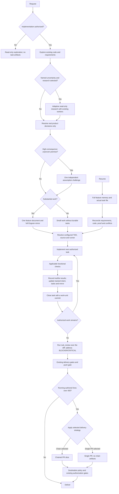

# README technical reference

This reference preserves detailed installation, configuration, ODD, runtime, and contributor material previously carried by the README. Start with the [README](../README.md) for the product overview; use this document when you need operational detail. Historical compatibility and authority passages remain reference material, not newly endorsed operator instructions.


## Organic Driven Development

Organic Driven Development (ODD) keeps explore → implement → proportionate checks as the development workflow. For large authorized implementation (its resume test fails), the parent automatically tracks feature progress after exploration, without asking for task-tracking or storage permission. Small, understood work creates no durable task artifact; investigation and proposal-only work stay read-only.

### The ODD protocol

ODD runs on every request, without the user asking for a workflow, a plan, or task tracking.

1. **Authorize** — read-only unless implementation is authorized; ask one clarification when intent is ambiguous.
2. **Explore** — read existing code and requirements first, proportionately to the request.
3. **Resolve uncertainty** — optional research or one focused product question only for a real unresolved decision.
4. **Classify** — by the Task Size section: small when understood, risk is contained, and the work could be resumed from the request plus `git diff`; large only when that resume test fails. Counts never classify.
5. **Track before the first write** — create the feature document and Engram mirror automatically for large work, and tell the user in one line.
6. **Implement task by task** — route each task through the smallest safe workflow, with configured TDD and applicable checks. Every task closes with at least one work-unit commit on the feature branch (branch first when on the default branch), with tests and docs alongside the behavior, using a Conventional Commit message; the feature document records the commit identity as evidence.
7. **Close** — report the verified outcome, failed/pending checks, and the next step.

- **One feature document:** `odd/tasks/<feature-name>.md` holds objective, problem, why, scope, constraints, actionable checklist with stable IDs and acceptance criteria, verification evidence, progress, and next step. Project-scoped Engram topic `odd/<feature-name>/tasks` mirrors the full document and repository-relative locator. Keep concise rationale for meaningful accepted changes here, not a separate plan or exhaustive journal. Accepted user, review, or verification changes update intent and tasks together; preserve valid completed work, add new tasks or reopen invalidated items with reasons. Findings alone do not authorize expansion or acceptance. Routine corrections stay with their tasks; checkoffs require observed proof.
- **Recovery:** write local progress first and read back both copies; writes are not atomic. Unavailable Engram leaves an explicit pending mirror, not invented success or a block on unrelated safe work. Before implementation or resume, the parent reads full feature memory and the actual task file, reconciles code and evidence, and preserves conflicting versions. Pass the locator and relevant context; workers read the document before edits. The existing Todo UI is a projection, not another authority.
- **Task size:** about 400 authored changed lines (additions plus deletions) is advisory only, not a cap, acceptance criterion, automatic stop, or forced split. Keep coherent behavior with tests and docs, explain natural overages, and continue under existing PR policy. Forward this instruction to workers; never remove whitespace, comments, or tests, minify, invent abstractions, or split artificially for cosmetic savings.
- **Delegation boundary:** the parent delegates a writer for tracked tasks only for a reason (parallel units or context), never for size, file count, or a price ratio, and a second direct path alone is not a runtime refusal. The runtime cannot infer whether an edit is mechanical from write history. Validate consequential premises before building, reuse relevant sibling findings, run focused checks while iterating, then the applicable full suite at closure. This is effort guidance, not a hard token or line budget.
- **Research:** optional research addresses a named uncertainty. Establish problem, intended outcome, constraints, and current evidence; inspect code and adapt depth to consequence, not fixed questionnaires or rounds. The parent asks one focused product question only when needed, then waits; workers return gaps. Use available authorized documentation/web tools, prefer primary sources, and attribute claims to URLs/code locations. Distinguish facts, assumptions, contradictions, freshness, and gaps; return a recommendation, tradeoffs, open questions, and implementation implications. Forward these instructions to a fresh general worker. Unavailable evidence pauses only unsafe dependent decisions. Research stays read-only; a brief proposal is needed only for a real decision.
- **Assumptions:** at most one scoped independent read-only challenge for a high-consequence unproven premise, including a small security-critical change. Deterministic failures need fixes, not debate.
- **TDD:** resolve on/off from existing project/session configuration or explicit user choice; retain source and exact runner in the feature document when present and forward all three on every implementation delegation, refreshing on resume. Test presence does not enable TDD. Enabled requires observed RED before implementation → GREEN → REFACTOR; disabled still requires ordinary functional checks. Unknown/conflicting mode or a missing runner needs only the clarification affecting the next action, never invented precedence or commands.
- **Checks:** functional checks run per task; a TODO checkbox never triggers a review cycle.
- **Delivery:** at feature-document creation, forecast authored changed lines (additions plus deletions, generated files excluded) from the task list, and keep a running count from work-unit commits. Choose one delivery strategy per feature: `ask-on-risk` (default), `auto-chain`, `single-pr`, or `exception-ok`. When the forecast or running count exceeds about 400 authored changed lines, apply the chosen strategy before the next commit. `ask-on-risk` asks once using the ordered oversized-delivery menu; `auto-chain` asks only for a missing chain strategy and slices automatically with a cached choice. When either chaining path needs a choice, offer exactly these three semantic outcomes:

1. **Feature/tracker branch chain** — `chain_strategy=feature-branch-chain`; integrate the feature after reviewing child slices.
2. **Verified default/main branch chain** — `chain_strategy=stacked-to-main`; land slices in order on the verified destination default branch, not an assumed name.
3. **One single PR — least recommended** — `delivery_strategy=single-pr`; review the entire oversized change together.

Generate the complete user-facing question and every option label, description, and recommendation marker in the active user's conversation language (English for an English user, Spanish for a Spanish user, etc.). Machine strategy tokens remain unchanged and untranslated. These English examples are illustrative and localizable, not mandatory copy.

The third choice overrides the pending chaining path: clear the chain choice as inapplicable and suppress later chain prompts. `single-pr` is not a `chain_strategy` token; do not automatically select `exception-ok`. Least recommended is scoped to the oversized menu: larger single PRs increase reviewer load, slow feedback, and couple rollback. A focused ≤400-line single PR remains reasonable. Follow the destination repository's documented contribution/size policy; `size:exception` is a Gentle-owned repository policy, not a universal label requirement. Do not request or add it for generic users unless the destination policy uses it; keep applicable maintainer acceptance and protected-label authorization gates. Single-PR output requires no tracker, child dependency diagram, or Chain Context. Choosing shape does not authorize push, PR creation, merge, or review-mode/consent changes. Cache both choices, and record slice boundaries (which commits each PR holds) in the feature document for chains, or the whole-PR scope for single PR. Resolve the `work-unit-commits` and `chained-pr` skills by registry name before planning or creating any PR.



This is guidance through existing tools, not a new CLI, phase, state engine, or execution harness. Static prompt tests and scripted hook checks prove instruction delivery, not autonomous model adherence; actual create/update/resume behavior requires observed Pi sessions.

## Herdr active-work summary

Under Herdr, root interactive Pi sessions publish only the `in_progress` Todo
title, prefixed with `◐`. No phase, working/verifying label or tool fallback is
used; prompts, tool arguments, output and Todo notes never supply text. Missing,
invalid or empty active titles clear the display. Children, RPC/print modes and
missing Herdr/socket contexts do not publish. The packaged extension loads through
`gentle-shell`, including its isolated home; loading does not change your config.

Herdr 0.8.2/protocol 20 needs **two separate rows**, not a newline inside a token:
add `['$summary'], ['$summary2']` to the Agents sidebar rows in your config.
The first row is `◐ title`; the extension prefixes the optional continuation with
two spaces, though Herdr may normalize leading whitespace.
Text wraps by display cells, preferring word boundaries unless a grapheme-safe
word split avoids unnecessary truncation across the two rows. Ellipsis appears
only on the last overflowing row, or on an extremely narrow first row. Each token
is capped at 80 Unicode scalar characters, including icon, spaces and ellipsis,
before Herdr normalizes it; both tokens together are capped at 256 UTF-8 bytes
(excluding private newline framing). ANSI/bidi controls are removed while emoji
ZWJ sequences are preserved. Pathological oversized graphemes may be replaced by
an ellipsis.

Width comes from root `sidebar_width` in `session.json` beside `HERDR_SOCKET_PATH`,
less five columns for divider, possible scrollbar and the detail-row prefix.
Snapshots are bounded to 256 KiB and cached for five seconds while active; persisted
width can itself lag resize by five seconds. This is not live geometry. Missing,
malformed, oversized or unsupported snapshots fall back to 24 available columns;
other layouts may need manual adjustment. No CLI/socket query measures width.

Source `nubia:activity` owns only `summary`/`summary2`, not lifecycle. Updates are
latest-only, serialized and best-effort offline, with a 30-second TTL refreshed every
10 seconds while active. Each report clears an unused second row; idle, session
changes and shutdown clear both. TTL expiry covers abrupt exits. The managed Herdr
bridge remains lifecycle authority. Reports invoke `HERDR_BIN_PATH` when supplied,
otherwise `herdr` from `PATH`, without a shell.

## Navigation

- [Capabilities](#capability-reference)
- [Installation and release policy](#install)
- [ODD workflow and recovery](#organic-driven-development)
- [Review architecture](#review-authority-architecture-reference-only)
- [Configuration, commands, skills, and memory](#persona-modes)
- [Package contents and development](#package-contents)

## Capability reference

| Capability                     | What it does                                                                                                                                  |
| ------------------------------ | --------------------------------------------------------------------------------------------------------------------------------------------- |
| **el Gentleman persona**       | Makes Pi behave like a senior architect and teacher, not a generic chatbot. Spanish responses use Rioplatense voseo by default; neutral mode is saved globally with project overrides. |
| **Configurable startup intro** | Adds a rose/text-logo startup intro, compact runtime panel, color presets, and commands to hide or show the decorative parts.                  |
| **Work routing discipline**    | ODD keeps small tasks inline and delegates context-heavy work. |
| **Subagent orchestration**     | Keeps one parent session responsible while child agents explore, implement, test, or review with focused context.                             |
| **Strict TDD support**         | TDD mode, source, and runner come from configuration or explicit choice in ODD. Enabled TDD requires observed evidence; a test command alone does not enable it.                   |
| **Closed choice prompts** | Per-option hover/click/wheel in fullscreen; keyboard selection in either TUI mode. |
| **Native pointer regions** | Compose hover, press, click, and wheel behavior around public TUI components. |
| **Agent overlay close control** | Adds a header close button that adapts to available width. |
| **Reviewer protection**        | Surfaces review workload risk before a task turns into an oversized PR.                                                                       |
| **Per-agent model assignment** | Pi-native modal for assigning stronger or cheaper models to packaged and custom agents.                                                       |
| **Skill discovery registry**   | Maintains `.atl/skill-registry.md` from project and user skills so review/comment/PR workflows do not silently miss the right skill.          |
| **Skill creation workflow**    | Provides the `gentle-ai-skill-creator`/`gentle-ai-skill-improver` skills, `/skill-creation` prompt, and packaged style guide for LLM-first skills. |
| **Delivery skills**            | Includes issue-first PRs, chained PRs, work-unit commits, cognitive docs, comment writing, and Judgment Day review.                           |
| **In-process 4R review**       | `nub_review` runs the four review lenses (risk, reliability, resilience, readability) in process over the current diff; the push gate asks for confirmation when changes were not reviewed or were blocked. |
| **Runtime safety**             | Blocks destructive shell commands, asks for confirmation for sensitive operations, and blocks direct read/write/edit access to sensitive paths. |

## Native pointer regions

Compose pointer behavior around public `Text`, `Box`, or custom content without making it a keyboard target:

```ts
const scope = createNativePointerScope();
const openInput = scope.wrap(new Text("Open input", 0, 0), {
  onClick: () => {
    openInputEditor();
    return { handled: true };
  },
});
const panel = new Container();
panel.addChild(openInput);
const observer = scope.createMouseObserver(() => tui.requestRender());
```

Pass `observer` around the root's native mouse dispatch; reuse `panel` as custom or overlay content.
Pointer input is fullscreen-only. Regions preserve a consuming child's native result and do not focus
`Text`, activate on press or wheel, synthesize outside leave events, or alter terminal tracking.
Callers own keyboard policy, theme state, and business actions.

**Bash UI tradeoff:** `quiet-tools` leaves Bash execution and UI to Pi, preserving configured `shellPath` and shell prefixes. Bash no longer uses Gentle's quiet cards or direct-command lifecycle renderer; the six other quiet tool cards and codemode remain unchanged.

**Migration note:** Do not enable `pi-tool-cards` and `quiet-tools` together: Pi rejects duplicate `read`, `edit`, and `write` registrations. Disable or remove the standalone package during migration; gentle-pi does not change those package registrations or delete that repository. The global fullscreen setting described below is a separate install-time change.

## Install

Two paths reach the same package. Path A stays standalone; Path B installs into an existing pi.

### Path A: standalone `gentle-shell` (recommended, no pi changes)

```bash
npm i -g gentle-pi

# Own home, never touches your pi install
gentle-shell

# Reuse your pi sign-ins, models and chats instead
gentle-shell --link
```

`gentle-shell` alone starts in its own home, `~/.gentle-shell/agent`. `gentle-shell --link` reuses `~/.pi/agent` as-is. Run `gentle-shell home link` to make `--link` the default. Full flags, env vars, and modes: [gentle-shell launcher](#gentle-shell-launcher).

### Path B: inside an existing pi

```bash
pi install npm:gentle-pi
```

This installs the current npm release; select an explicit version if you need a reproducible pin. Restart Pi after installation.

### Source checkout

This checkout ships no gentle-ai binary: review is the in-process 4R `nub_review`. Checkout metadata alone is not proof of npm publication.

### Pi compatibility

The current package requires Pi 0.99.1 or newer and Node >=22.19.0. Development tests resolve Pi through the open `>=1.0.0` development range. The private Vim editor adapter admits only the audited Pi `0.99.1`, `0.99.2`, and `1.0.0` releases; any other release keeps ordinary prompt editing until its editor is audited. Use the latest Pi release; gentle-pi does not update your installed Pi automatically. Children, including any `GENTLE_PI_AGENTS_PI` override, must emit `agent_settled`: `agent_end` records a run's output but is not completion because retries or queued continuations may follow.

The [`v2.6.0` release](https://github.com/Gentleman-Programming/gentle-shell/releases/tag/v2.6.0) added persistent registered worktrees and grouped `/nubia:changes` views; fuller workspace interaction details are in the [Gentle Shell reference](gentle-shell.md). It also adds named atomic `/nubia:profiles`, native review intended-untracked selection and provider continuations, and opt-in custom ask responses. Pi recognizes its global Git-managed package path; subsystems install with explicit recovery guidance when npm lifecycle work was skipped. Windows keeps child consoles hidden and fixes ownership mode; Gentle Todo keeps the next pending task visible when collapsed.

### Install-time fullscreen

A successful postinstall in Pi's **global npm-managed** `agent-home/npm/node_modules/gentle-pi` or exact **global Pi Git-managed** `agent-home/git/github.com/Gentleman-Programming/gentle-pi` installation persists `"tuiMode": "fullscreen"` in `agent-home/settings.json`, preserving other settings. Agent home resolves through `GENTLE_PI_AGENT_HOME`, then `PI_CODING_AGENT_DIR`, then `~/.pi/agent`. Use `/settings` to switch back to regular; rerunning a recognized postinstall resets it to fullscreen. Existing project overrides still take precedence.

Project-local installs (`pi install -l`), Git installs outside that exact global Pi path, local-path installs, temporary packages, development checkouts, ordinary npm consumers, and pnpm symlink-store packages do **not** receive this change. Updates or installs that do not execute postinstall cannot reassert it; this is not a universal install/update guarantee or a change to historical releases.

Malformed/nonobject JSON, symlink/nonregular settings, unsafe paths, or a busy settings lock fail without replacing settings. The installer coordinates with Pi's cooperative settings lock and uses atomic replacement; it does not guarantee safety against noncooperating writers or malicious concurrent directory replacement. Already-fullscreen settings remain byte-identical. Native installation failure leaves settings untouched; `GENTLE_PI_SKIP_GENTLE_AI_INSTALL=1` skips only native provisioning, not the recognized global fullscreen setting.

# Stable release
pi install npm:gentle-pi@3.5.1
```


Recommended companion packages, into the standalone `gentle-shell` home:

```bash
gentle-shell install npm:pi-intercom
gentle-shell install npm:gentle-engram
gentle-shell install npm:pi-web-access
gentle-shell install npm:pi-lens
gentle-shell install npm:@juicesharp/rpiv-ask-user-question
```

`--link` before the subcommand (for example `gentle-shell --link install npm:pi-intercom`) targets `~/.pi/agent` instead of the isolated home.

Or, when `gentle-pi` is installed inside an existing pi:

```bash
pi install npm:pi-intercom
pi install npm:gentle-engram
pi install npm:pi-web-access
pi install npm:pi-lens
pi install npm:@juicesharp/rpiv-ask-user-question
```

Then start Pi in a project:

```bash
pi
```

`gentle-pi` installs delegation and review agents at startup. Substantial ODD work tracks progress in a project feature document; no separate workflow setup is required.

## gentle-shell launcher

`gentle-shell` (installed by `npm i -g gentle-pi`, exposed as the package's `bin`) opens pi with the Gentle Shell package loaded, without installing it into your pi agent or touching its `settings.json`. It is a thin `bin/nub-ia.mjs` wrapper around the pure, unit-tested `lib/gentle-shell-launcher.ts` (built to `runtime/gentle-shell-launcher.mjs`); the wrapper owns process, filesystem, and child-process wiring only.

```bash
gentle-shell [options] [-- pi-args...]
gentle-shell home [link|isolated|<path>]
gentle-shell [home selectors] setup [--dry-run]
```

### Flags

| Flag | Effect |
| --- | --- |
| `--link` | Home is `PI_CODING_AGENT_DIR` or `~/.pi/agent`. Reuses your existing pi sign-ins, models, and chats; never writes to its `settings.json`. |
| `--isolated` | Home is `GENTLE_SHELL_HOME` or `~/.gentle-shell/agent`. No credential seeding. Default when nothing else is configured. |
| `--home <path>` | Home is the given directory. |
| `--package-root <dir>` | Force this directory as the gentle-pi package to load, taking over from any conflicting package the target `settings.json` already declares (see "Loading the package" below). |
| `--help`, `-h` | Print usage (flags, commands, env vars) and exit 0. |
| `--version` | Print `gentle-shell <version>`, `pi <version>`, and `home <mode> <dir>`, then exit 0. |
| `--` | Everything after is forwarded to pi verbatim, even text that looks like a `gentle-shell` flag. |

`--link`, `--isolated`, and `--home` are mutually exclusive; combining two is a usage error, as is `--home` or `--home=` with an empty value. Effective-home precedence: an explicit flag wins, then the persisted `home` subcommand choice, then the `--isolated` default. Every argument gentle-shell does not recognize — `--mode rpc`, `-p "..."`, etc. — is forwarded to pi unchanged.

### `home` subcommand and `~/.gentle-shell/config.json`

`gentle-shell home` alone prints the effective mode and directory (`<mode> <dir>`) without persisting anything. `gentle-shell home link`, `gentle-shell home isolated`, or `gentle-shell home <path>` persists that choice to `~/.gentle-shell/config.json` as `{"home": "link" | "isolated" | "<path>"}`, so a later plain `gentle-shell` picks it up; a flag on a given invocation still overrides the persisted config without rewriting it.

### Managing packages

`gentle-shell install npm:<pkg>`, `gentle-shell remove ...`, `gentle-shell list`, `gentle-shell update ...`, `gentle-shell config`, and `gentle-shell auth ...` run pi's own commands against the resolved home — the `--isolated` home by default, or your own pi home with `--link`. A launcher flag before the subcommand (`--link`, `--isolated`, `--home <path>`) still selects which home the subcommand runs against. Running `gentle-shell install npm:gentle-pi` inside the isolated home is unnecessary: the launcher already loads the Gentle Shell package itself (see "Loading the package" below).

`gentle-shell update` and `gentle-shell list` follow that same home selection, so they inspect and update packages in whichever home the effective flag or persisted `home` config points to.

### `setup` subcommand

`gentle-shell setup` provisions the resolved home (the same home selection as any other invocation: `--isolated` by default, or `--link`/`--home <path>` when given before `setup`) with the team companion packages. It resolves the home and the pi runtime exactly as a normal run does (including the isolated/`--home` bootstrap and the pi version gate), then installs each team package (`TEAM_PACKAGE_SOURCES` in `lib/gentle-shell-launcher.ts`, or `GENTLE_SHELL_TEAM_PACKAGES`) the home does not declare yet, through the resolved pi runtime's own `install`, with `PI_CODING_AGENT_DIR` and `GENTLE_PI_AGENT_HOME` set to the resolved home.

```bash
gentle-shell [home selector] setup [--dry-run]
```

- `--dry-run` reports which team packages setup would install and spawns nothing.
- There is no gentle-ai binary any more: setup never downloads or spawns one, and never snapshots or restores shared persona/state files.
- After the installs the home's `settings.json` theme is put back if a pi `install` changed it (never for `--link`).
- `GENTLE_SHELL_TEAM_PACKAGES` is a comma-separated list of package sources that replaces the packaged team list (an empty string installs nothing).

### pi runtime resolution

1. `GENTLE_SHELL_PI` — path to a pi executable, when set to a non-empty value.
2. The bundled `@earendil-works/pi-coding-agent` resolved next to gentle-pi (`dist/bundle/cli.js`, run with the current `node`), when installed as its optional peer dependency.
3. `pi` on `PATH`.

Adjacent resolution uses Pi's public ESM entry, then verifies the canonical package root, package name and declared `pi` bin. Only a genuinely absent optional peer permits PATH fallback; an invalid installed package fails rather than silently selecting another runtime. Pi AI and TUI are optional `"*"` host peers, not runtime dependencies, so managed extensions use the host's classes and registries. The launcher still gates the actual runtime version before home bootstrap. This is a one-time baseline upgrade, not an auto-updater.

If none resolve, `gentle-shell` exits 1 naming all three options. Once a runtime is found, its `pi --version` must be at least `0.99.1` (the coding-agent peer minimum): an older version exits 1 naming the found and required versions, and unparsable `--version` output exits 1 naming the required minimum.

### Environment variables

| Variable | Effect |
| --- | --- |
| `GENTLE_SHELL_PI` | Overrides pi runtime resolution (see above). |
| `GENTLE_SHELL_HOME` | Overrides the isolated home directory (default `~/.gentle-shell/agent`). |
| `PI_CODING_AGENT_DIR` | Read to resolve the `--link` home; also set on the pi child process to the effective home. |
| `GENTLE_PI_AGENT_HOME` | Set on the pi child process to the effective home; gentle-pi's own home resolution reads it back. |
| `GENTLE_SHELL_NO_AUTO_SETUP` | Set to `1` to skip automatic first-run provisioning (see "First run in an isolated or custom home" below). |

### Loading the package

Unless the target home's `settings.json` already declares gentle-pi, every invocation injects `-e <package root> --theme <root>/themes --skill <root>/skills --prompt-template <root>/prompts` ahead of the forwarded arguments, so the Gentle Shell extensions, themes, skills, and prompt templates load without a separate `pi install`. Every mode — `--link`, `--isolated`, and `--home <path>` — consults the home's own `settings.json` for a declaration; an isolated or `--home` home only ever carries one by running `gentle-shell setup` (see above), which installs `npm:gentle-pi` into it, or by hand-editing `settings.json`. A home without any declaration always gets the plain injection — except when the forwarded arguments start with one of pi's own subcommands (`install`, `remove`, `uninstall`, `update`, `list`, `config`, `auth`): pi dispatches those on `argv[0]` before it parses any flags, so the injection — and any take-over below — is skipped entirely and pi sees the bare subcommand, e.g. `gentle-shell install npm:x` runs exactly `pi install npm:x`. A subcommand never triggers a take-over, even against a home whose settings declare a conflicting gentle-pi; see "Managing packages" above.

A declaration is recognized either as `npm:gentle-pi[@version]` in the `packages` array, or as a local path package (string or `{"source": "..."}` entry, relative or absolute) whose own `package.json` names it `"gentle-pi"` — the shape produced when gentle-pi is developed from a checkout and referenced by path in `settings.json` instead of installed via `pi install npm:gentle-pi`.

- **A pi subcommand as the first forwarded argument**: no injection and no take-over at all, regardless of any declaration — pi must see the bare subcommand as `argv[0]`.
- **npm declaration matching this launcher's own install**: no injection — pi already loads gentle-pi from the declared package.
- **No declaration at all, or a path declaration that resolves (after `realpath`) to this launcher's own package root**: the same plain injection as above.
- **A declaration that resolves to a *different* gentle-pi** (a different checkout declared by path, for example) **— take-over**: `gentle-shell` prints `taking over gentle-pi from <declared source> for this run (settings unchanged; its skills, prompts, and themes still load alongside this launcher's)` to stderr, then runs pi with `--no-extensions` followed by an explicit `-e <dir>` for every *other* package already in settings (npm entries resolve to `<agent dir>/npm/node_modules/<name>`; path entries resolve relative to the settings file), then loose extension entries for `<agent dir>/extensions` and the project-local `<cwd>/.pi/extensions` (each candidate directory only consulted when it already exists), and finally its own `-e <package root> --theme ... --skill ... --prompt-template ...`. `settings.json` itself is never modified, and every `-e` path — including the launcher's own package root — is injected at most once even if it would otherwise repeat.

  A declared *other* package whose resolved directory does not actually exist (a hand-edited `settings.json`, a failed or interrupted `pi install`, or an npm store laid out anywhere other than `<agent dir>/npm/node_modules`) is skipped with a stderr warning naming the source and the resolved path, instead of being handed to pi as an unresolvable `-e` that would fail the whole launch with "Cannot find module".

  `--no-extensions` disables pi's normal directory-discovery pass, and pi's `-e` flag hands a path straight to its module loader with no discovery of its own — passing a loose extensions directory as-is via `-e <dir>` fails with "Cannot find module" unless that directory is itself a self-contained extension. So each loose candidate directory is resolved before injection: a directory that is itself a self-contained extension (a `package.json` declaring a `pi.extensions` manifest) is passed through as a single `-e <dir>`; otherwise its direct `*.ts`/`*.js`/`*.mjs` files — including a root-level `index.ts`/`index.js`, which is just another loose file — and any `<subdir>/index.ts`/`index.js` are discovered individually — mirroring pi's own directory scan — and each is injected as its own `-e <file>`. Hidden entries (dotfiles) and `*.d.ts` declaration files are skipped, since neither was ever a runnable extension.

  A git-sourced other package is skipped with a stderr warning, since its install directory cannot be derived without pi's own package manager; an object entry with `extensions` or `autoload` filters is still included but warned about, because the take-over cannot honor those filters for extension discovery — that package's skills, prompts, and themes still load normally through settings discovery, which `--no-extensions` does not affect.

  **Known limitation**: the take-over never removes the original declaration from `settings.json`, so its skills, prompt templates, and themes are still discovered alongside this launcher's own — only its extensions are replaced by `--no-extensions` plus the injected `-e` flags above.
- **`--package-root <dir>`**: forces a take-over using `<dir>` as the package root, even when settings already declare a matching `npm:gentle-pi`, or when there is no declaration at all. Use it to test a different gentle-pi checkout against a home whose settings already point at another one. Has no effect when the forwarded arguments start with a pi subcommand, since a subcommand skips the take-over entirely. This *forcing* behavior — a take-over with no matching declaration required — is only ever reached for `--link`: with `--isolated` or `--home <path>`, `--package-root` still changes which directory is injected, but on its own it goes through the same plain injection as "no declaration at all" above — no `--no-extensions`, and no other-package or loose-extension re-injection. A settings.json declaration in an isolated or `--home` home (one `gentle-shell setup` installed, or a hand-edited path entry) still triggers its own take-over there exactly as it would for `--link`, independent of `--package-root`. When that declaration is present and the home is not `--link`, `--package-root` has no effect at all — `gentle-shell` prints one stderr warning naming both the home and the ignored directory instead of silently dropping the flag. `--package-root` must also name an existing directory; a missing or non-directory path fails fast with a clear error instead of launching pi with unresolvable flags.

This take-over exists because two gentle-pi copies loaded at once — the declared one plus this launcher's own injection — register the same tools and extensions twice, which pi reports as tool conflicts (for example `Tool ask_user_choice conflicts with ...`).

### First run in an isolated or custom home

The first time `gentle-shell` resolves to an isolated or `--home <path>` home that does not already exist, it creates the directory, writes `"tuiMode": "fullscreen"` and, unless the home's `settings.json` already declares one, `"theme": "Gentleman-Cute"` into its `settings.json`, writes a small ownership marker file at `<home>/.gentle-shell-home` (a one-line JSON object naming the `gentle-pi` version that created it), and prints one hint to stderr pointing at `--link`. A `--link` home is never bootstrapped this way — it is assumed to already exist as your pi agent home. Later runs against the same home skip the write and the hint. The default theme is also re-applied after automatic or manual setup if gentle-ai's own managed install wrote a different theme into a home that had none before that run; a home (or `--link`) that already declares its own theme is never touched.

Right after that bootstrap, and on every later launch, a plain `gentle-shell` against an isolated or `--home <path>` home (never `--link`, and never a pi subcommand like `gentle-shell install/remove/list/...`) also runs the same flow as `gentle-shell setup` automatically before starting pi, so you never have to know `setup` exists. It runs when the home has never been provisioned, was provisioned with a gentle-ai pin different from the package-local pin this `gentle-pi` ships — for example after upgrading `gentle-pi` to a version pinned to a newer gentle-ai — or was provisioned by a different `gentle-pi` version than the one now running — for example after `npm i -g gentle-pi` upgrades the launcher itself, so the home re-syncs to match it. A completed run is recorded as `provisioned: {"<realpath of the home>": {"gentleAi": "<pin>", "gentlePi": "<running gentle-pi version>", "at": "<ISO timestamp>"}}` in the launcher's config.json (`~/.gentle-shell/config.json` by default, or `GENTLE_SHELL_CONFIG` when overridden — see "Environment variables" above), preserving every other key already in that file (including the persisted `home` mode and any other home's marker). A marker written before this `gentlePi` field existed always counts as needing provisioning too, so the very next launch backfills it.

Every child process the flow spawns (each `pi install` of a team package) has its stdout routed to this launcher's own stderr, together with the flow's own notices, so a headless consumer's stdout — `gentle-shell --mode rpc` or `gentle-shell -p "..."` — stays exactly what it always was: pi's own output, nothing else. The first time it runs in a home you see `gentle-shell: first run in <home>: installing the Gentle AI companion packages (one time; set GENTLE_SHELL_NO_AUTO_SETUP=1 to skip)`; on a gentle-ai pin change you see `gentle-shell: gentle-ai pin changed (<old> -> <new>): updating <home>`; on a gentle-pi version change you see `gentle-shell: gentle-pi changed (<old> -> <new>): updating <home>`; when both changed at once, one line names both.

Automatic provisioning only ever touches a home `gentle-shell` itself owns: the dedicated isolated home, a `--home <path>` (or persisted `home <path>`) that is new or already empty, one carrying the `.gentle-shell-home` ownership marker the bootstrap above wrote (so a `--home` directory whose *first* auto-provision attempt failed — leaving only the bootstrapped `settings.json` and marker behind — is still retried on the next launch instead of being mistaken for a foreign, pre-existing directory), or one this same config marker already recorded as provisioned before (so a later gentle-ai/gentle-pi re-sync still runs). A `--home` that already has content and neither marker — for example pointing at an existing, unrelated directory — is left alone, with one stderr hint (`` gentle-shell: <dir> already has content and was not set up by gentle-shell; run `gentle-shell <home flags> setup` to provision it ``) instead of a silent skip; pointing it at pi's own default agent home is refused the same way even when that directory is empty. `gentle-shell setup` run manually still works against any home — that is explicit intent, not automatic provisioning.

A failed flow (a non-zero `pi install` exit, or an install that runs past its timeout ceiling — 15 minutes by default — and gets killed) never blocks the launch: `gentle-shell` prints `` gentle-shell: automatic setup failed (exit <n>); starting anyway and retrying next run. Run `gentle-shell <home flags> setup` to see the full output. ``, followed by the underlying reason on the next line when one is known (a timeout's reason names the *effective* ceiling that fired — `` timed out after 15 minutes `` by default, or in seconds for a shorter override), writes no marker, and starts pi with today's plain injection (the home has no `npm:gentle-pi` declaration to skip it for). The next launch against the same home retries automatically. Manual `setup` never has that ceiling. A spawned child dying by a signal on its own — a crash, an OOM kill, an external `kill`, anything gentle-shell itself did not ask for — is just another failure reported the same way; pi still launches. Only an interrupt actually reaching `gentle-shell` itself (Ctrl-C, or SIGTERM/SIGHUP delivered to the launcher process) is different: it forwards that signal to whichever child is running, kills it, and exits `gentle-shell` itself immediately with the matching signal exit code, without starting pi — you asked the process to stop, not to fall back. This launcher-interrupt tracking covers the package-local gentle-ai install and each `pi remove` cleanup step (both driven through the same async spawn helper); the installer self-heal step that recovers a missing package-local gentle-ai binary runs synchronously and does not carry the same tracking — an interrupt reaching the launcher during that narrow step falls back to Node's default signal handling instead. An otherwise-unexpected failure anywhere in the flow itself (for example an unwritable config.json directory) is also never fatal: it is reported the same way and the launch continues.

Concurrent first runs against the same home are serialized with an exclusive lock file at `<home>/.gentle-shell-setup.lock`: a second `gentle-shell` process started while the first is still provisioning skips auto-provisioning for that run instead of racing another setup, with one stderr notice. A lock older than 15 minutes is treated as stale — left over from a run that crashed or was killed before it could clean up — and is removed (after re-confirming it is still stale right before removal, so a lock a concurrent process just refreshed is never deleted out from under it) so provisioning can proceed. The lock is always removed once the flow finishes, successfully or not.

Set `GENTLE_SHELL_NO_AUTO_SETUP=1` to skip automatic provisioning entirely and keep today's plain-injection behavior on every launch; `gentle-shell setup` (see above) still works as a manual, explicit step. `--link` is never auto-provisioned — it reuses your existing pi agent home as-is, credentials included.

**Known limitation**: like `gentle-shell setup`, automatic provisioning never copies credentials into the home it provisions — a freshly auto-provisioned isolated or `--home` home still needs its own `/login` (or equivalent) inside pi.

### Windows shims

On win32, when the resolved pi command ends in `.cmd` or `.bat` — the shape an npm-installed `pi` or a `GENTLE_SHELL_PI` override commonly takes — `gentle-shell` runs it through `cmd.exe` as one quoted command line instead of spawning it directly, because current Node releases refuse to spawn a batch file without `shell: true`. This applies to both the version probe and the real launch.

### Postinstall fullscreen guard

gentle-pi's postinstall only writes the global `tuiMode: fullscreen` setting when the running package directory is a pi-managed install: under an `npm/node_modules` segment, or the exact `git/github.com/Gentleman-Programming` Git layout. `npm i -g gentle-pi`, a development checkout, and other layouts are recognized and skipped, logging `gentle-pi skipped enabling fullscreen in global Pi settings: <dir> is not a pi-managed install (npm install -g, a git checkout, and npx all land here).`

### Interactive RPC hosts

Setting `GENTLE_SHELL_INTERACTIVE_HOST=1` on a `pi --mode rpc` process turns on two things a plain headless RPC host does not get: dialogs for `ask_user_question` and `ask_user_choice` (one `ctx.ui.select` prompt per question, looped for multiSelect), and Gentle Agents' helper activity pushed live through `setWidget`. A subagent child spawned by such a host never inherits the variable, so nested children stay headless regardless of their parent. See the [activity payload reference](gentle-agents-activity.md) for the exact schema, field bounds, and shrink order.

### Herdr lifecycle bridge

For an interactive isolated-home launch inside Herdr, `gentle-shell` explicitly loads the existing managed `extensions/herdr-agent-state.ts` bridge. It looks first in the selected agent home, then the incoming `PI_CODING_AGENT_DIR`, then `~/.pi/agent`, using the first readable file's canonical path. Pi deduplicates that same file against normal discovery, explicit `-e` aliases, and package-manifest entries; presence alone is not treated as proof that it loaded. The launcher does not implement a second reporter, copy the bridge, or rewrite home configuration.

Automatic loading requires `HERDR_ENV=1`, a nonempty `HERDR_PANE_ID`, an existing Unix socket at `HERDR_SOCKET_PATH`, and terminal stdin/stdout. It is skipped for `--no-extensions`/`-ne`, print/JSON/RPC modes (including interactive RPC hosts), export/model listing, package commands, and Gentle Agents children. `--mode text` still permits an interactive TUI. Linked and explicit custom homes keep their own resource policy; use normal Pi discovery or an explicit `-e` there. An absent or unreadable bridge is nonfatal. User-supplied extension paths remain unchanged, including under `--no-extensions`; this automatic bridge is not added on top of that opt-out.

### Herdr blocker events

The Gentle AI adapter projects native `gentle-pi:ask-user-question:blocked`, legacy `rpiv:ask-user:blocked`, choice blockers, and guarded confirmations into one balanced `herdr:blocked` interval. It emits one activation when blocking begins and one release after the last source clears, retaining the initial generic label without relabel pulses. Native and legacy questionnaires are tracked independently; duplicate or malformed source events are ignored. Questionnaire answers, prompts, and commands are not included in the projection. This adapter emits local events; transport availability is a separate concern.

## Quick start

```text
/nubia:status          Check package assets and global model config.
/nubia:doctor          Run read-only diagnostics for assets, config, tools, and guards.
/nubia:models             Assign global model/effort routing to packaged/custom agents.
/nubia:profiles           Create, switch, and manage global agent-model profiles.
/nubia:persona            Switch between gentleman and neutral persona modes.
/nubia:background-subagents  Show or set the managed background-subagents policy, with its deciding source.
/nubia:animations         Show or set global animations: quality, performance, or potato.
/nubia:banner             Configure startup rose, text logo, and color preset.
```

Typical flow:

1. Open Pi in your repo.
2. Run `/nubia:status`.
3. Describe the outcome, for example: "Add CSV export using the existing report filters." ODD explores, implements authorized changes, and checks the result.
4. For large work, inspect the feature document and evidence; resume reconciles the full file and Engram copy.

## Core workflow

1. **Install and inspect.** Install `gentle-pi`, open Pi in the target repository, then run `/nubia:status` or `/nubia:doctor`.
2. **Use ODD.** Explore and clarify proportionately; track large work in one feature document with a full Engram recovery copy.
3. **Build with evidence.** One focused writer implements authorized scope using the forwarded TDD mode/source/runner. Enabled TDD requires observed RED → GREEN → REFACTOR; disabled still runs functional checks. Test presence is not activation.
4. **Review with `nub_review` before delivery.** The in-process 4R review runs over the diff; the push gate asks for confirmation when changes were not reviewed or were blocked.
5. **Deliver through ordinary repository policy.** Review and Judgment Day evidence is informational only; Pi never creates a delivery route, authorization, target rederivation, or receipt gate.

> **Trust what the system can derive, not what an agent claims.** Agents analyze the candidate; `nub_review` runs the four review lenses in process over the diff. Review outcomes inform delivery; the push gate asks for confirmation when changes were not reviewed or were blocked. Dangerous-command safety remains independent.

## How the harness decides what to do

`gentle-pi` routes through the smallest safe workflow:

| Request shape                                                               | Harness                      |
| --------------------------------------------------------------------------- | ---------------------------- |
| Small, clear, local edit                                                    | Inline direct work.          |
| Unknown codebase area or context-heavy investigation                        | Focused subagent delegation. |
| Substantial authorized work needing recoverable progress | ODD with a feature document and focused workers. |

Size and uncertainty can call for scoped exploration or delegation within ODD. The delegation triggers below select execution topology, not a different development method.

### Delegation triggers

`gentle-pi` keeps the parent session thin and delegates at the narrowest useful point. When the Pi Subagents extension is installed, the preferred runtime is the `subagent_*` tool family because it runs the user's configured project/global subagent definitions and preserves history/background behavior. With the background policy on, delegations default to background mode: the terminal stays free and each result comes back as a message that starts a new turn; task mode is the bounded print-mode alternative and also supports delegations that must ask the user something mid-flight. Background work requires a live interactive/RPC parent; `subagent_run` and `subagent_continue` reject background mode in the single-shot modes `pi -p` and `pi --mode json`, which exit before a later result can be received. If those tools are unavailable, the parent should fall back to Pi's native `Agent` tool or another available delegation mechanism. The requirement is delegation; the runtime is capability-dependent.

| Trigger                                                                                                                     | Required behavior                                                             |
| --------------------------------------------------------------------------------------------------------------------------- | ----------------------------------------------------------------------------- |
| Understanding needs more than the evidence budget (one parallel batch of at most 3 calls, ~10k tokens) or more than ~5 sequential lookups | Launch `scout`, `context-builder`, or the closest read-only mapping subagent; it returns a handoff of at most ~2k tokens with `path:line` evidence. Never force delegation for a small targeted question. |
| A large (tracked) task                                                                                                      | Track it in the logbook; delegate a writer only for a reason (parallel units or context), never for size, file count, or a price ratio. |
| A high-risk change                                                                                                          | Run an independent verifier after the change's own checks; otherwise the focused test and suite run inline. |
| Commit, push, or PR after code changes                                                                                      | Follow the loaded native instruction, or ordinary repository policy when none is supplied. |
| Wrong cwd, worktree/git accident, merge recovery, confusing test/env issue                                                  | Stop, preserve the affected scope, and investigate separately before resuming. |
| Parent context past ~150k tokens | Pause and delegate the next bounded unit of work, or stop and explain the exact blocker. Keep command output bounded; a small task still runs its focused test and suite inline. |

The intended balanced loop for a bounded bugfix is:

```text
parent git/status + clarify → one worker writes authorized fixes → focused verification → parent reports
```

`scout`/`context-builder` save parent context by compressing broad exploration. `worker` runs one bounded writer thread; parallel writers only with disjoint Allowed edit surfaces (runtime-enforced) or isolated worktrees.

"Runtime-enforced" means an admission-time check inside one Pi process: when `subagent_run` or `subagent_continue` queues a bounded writer, it is rejected if a queued or running writer of the same parent process, in the same worktree, has an overlapping `## Allowed edit surfaces` entry. Writers are keyed by their canonical worktree root (the realpath of the Git worktree root, or the realpath of the cwd outside Git), so a subdirectory cwd, the root itself, and a symlinked spelling count as one worktree. It is not a write-time guard: it does not stop a writer from editing outside its declared surfaces, and separate Pi parent processes do not coordinate with each other. Overlap is conservative: an entry also covers everything under it, a whole-segment `**` covers any depth, while `**` inside a segment (for example `src/**.ts`) matches within that one segment, like minimatch. Entries compare in Unicode NFC. Entries with bracket classes, extglob groups, backslashes, or nested, unbalanced, or `/`-spanning braces overlap every other entry, and a wildcard never proves two entries disjoint when either contains non-ASCII characters. A quarantined writer whose process exit is unconfirmed keeps its surfaces until the exit is confirmed; a process that survives quarantine keeps both its surface claim and its concurrency slot until its exit is observed, which can last for the parent's lifetime. Any RDD-specific actor behavior belongs to the runtime instruction supplied by Gentle AI, not to this README.

## Package-managed agents and optional research

At startup, `gentle-pi` installs and refreshes only hash-proven delegation and review agents. User-edited files and project overrides remain untouched. Refresh a selected owner explicitly when needed:

```text
/nubia:install-delegation --force
/nubia:install-review --force
```

Saved model routing is applied separately; these installation commands do not change model settings. Optional ODD research depends on active, authorized tools. Verify source-backed findings, cite the sources actually retrieved, and disclose unavailable evidence instead of treating tool inventory as proof or inventing citations. Research is read-only; unavailable evidence pauses only decisions that depend on it. A source checkout edit does not activate an already installed package; activate the updated package separately before expecting changes in a new session.

## Skill registry

`gentle-pi` keeps a local registry at:

```text
.atl/skill-registry.md
```

The registry scans project and user skill roots, not package-owned skills. It exists to catch workflow skills that are present on disk but not visible in Pi's injected skill list.

It scans common roots such as:

```text
./skills
.opencode/skills
.claude/skills
.gemini/skills
.cursor/skills
.github/skills
.codex/skills
.qwen/skills
.kiro/skills
.openclaw/skills
.pi/skills
.agent/skills
.agents/skills
.atl/skills
~/.pi/agent/skills
~/.config/agents/skills
~/.agents/skills
~/.kimi/skills
~/.config/opencode/skills
~/.config/kilo/skills
~/.claude/skills
~/.gemini/skills
~/.gemini/antigravity/skills
~/.cursor/skills
~/.copilot/skills
~/.codex/skills
~/.codeium/windsurf/skills
~/.qwen/skills
~/.kiro/skills
~/.openclaw/skills
```

Behavior:

- `.atl/.gitignore` receives a `*` rule when needed; the root `.gitignore` is unchanged;
- the registry refreshes on session start, but automatic writes (including watcher refreshes) preserve Git-tracked targets;
- skipped writes warn with the protected paths and `/skill-registry:refresh` as the deliberate regeneration path; Git detection failures skip automatic writes rather than assuming files are untracked;
- startup refresh is skipped when Pi starts with `--no-skills` / `-ns`, `--no-skill-registry`, or `GENTLE_PI_NO_SKILL_REGISTRY=1`;
- `/skill-registry:refresh` intentionally regenerates the registry and cache and updates the child ignore, even when tracked; review the resulting Git diff;
- a best-effort watcher refreshes when skill files change;
- the registry indexes skill names, full descriptions, scope, and exact `SKILL.md` paths without copying skill body rules.

Skill discovery is a guardrail, not a workflow router: it helps Pi load the right skill without forcing extra ceremony.

`gentle-pi` also ships package-owned `gentle-ai-skill-creator` and `gentle-ai-skill-improver` skills plus the `/skill-creation` prompt for creating or updating project skills. Both skills use `docs/skill-style-guide.md` as their normative style contract. The workflow checks for duplicates, keeps `SKILL.md` concise, uses one-line trigger-rich frontmatter, and reminds maintainers to refresh the registry after skill changes.

Packaged skills include `cognitive-doc-design`, `comment-writer`, `gentle-ai-judgment-day`, `gentle-ai-skill-creator`, `gentle-ai-skill-improver`, and the other delivery/review skills under `skills/`.

Compatibility: the package keeps the existing skill folders (`skills/branch-pr`, `skills/cognitive-doc-design`, `skills/comment-writer`, `skills/judgment-day`, `skills/skill-creator`, `skills/skill-registry`, and `skills/work-unit-commits`) but their exported frontmatter names are prefixed to avoid collisions with user/global skills. Treat former package names such as `branch-pr`, `cognitive-doc-design`, `comment-writer`, `judgment-day`, `skill-creator`, `skill-registry`, and `work-unit-commits` as legacy aliases in prose; runtime skill selection should use `gentle-ai-branch-pr`, `gentle-ai-cognitive-doc-design`, `gentle-ai-comment-writer`, `gentle-ai-judgment-day`, `gentle-ai-skill-creator`, `gentle-ai-skill-registry`, and `gentle-ai-work-unit-commits`.

Delegation contract:

- parent/orchestrator resolves project/user skills from the registry and passes matching paths under `## Skills to load before work`;
- during normal runtime, subagents should not independently discover additional project/user `SKILL.md` files or the registry;
- fallback loading is degraded self-healing and must be reported via `skill_resolution` as `fallback-registry`, `fallback-path`, or `none`.

## Persona modes

```text
/nubia:persona
```

| Persona     | Behavior                                                                                                      |
| ----------- | ------------------------------------------------------------------------------------------------------------- |
| `gentleman` | Senior architect, teacher, direct technical feedback, Rioplatense Spanish/voseo when the user writes Spanish. |
| `neutral`   | Same discipline, warmer professional language, no regional expression.                                        |

Saved globally at:

```text
~/.pi/gentle-ai/persona.json
```

A project can still override the global default with:

```text
.pi/gentle-ai/persona.json
```

`/nubia:persona` writes the global config and updates an existing project override when one is present, so the current project does not stay stale. Run `/reload` or start a new Pi session after switching persona.

## Model and effort assignment

```text
/nubia:models
```

The modal discovers:

- project agents in `.pi/subagents/`, `.pi/agents/`, and `.agents/`;
- user agents in `~/.pi/agent/subagents/`, `~/.pi/agent/agents/`, and `~/.agents/`.

When applying routing, project agents write runtime profiles to `.pi/subagents.json`; global and built-in agents write profiles to `~/.pi/agent/subagents.json`.

Recommended model/effort shape:

| Agent kind                 | Recommended model                                    | Recommended effort (`thinking`) |
| -------------------------- | ---------------------------------------------------- | ------------------------------- |
| Explore and mapping        | Fast and cheap is usually enough.                    | `off` to `low`                  |
| Implementation             | Strong coding and tool-use model.                    | `medium` to `high`              |
| Verify / review            | Strong fresh-context model.                          | `high`                          |
| Tiny utilities             | Inherit active/default model unless they bottleneck. | `inherit`                       |

Saved globally at:

```text
~/.pi/gentle-ai/models.json
```

Existing project-local `.pi/gentle-ai/models.json` files are still read as a legacy fallback when no global model config exists, but `/nubia:models` writes the shared global config.

Inside `/nubia:models`, press `x` to export the saved routing to `~/.pi/gentle-ai/models.export.json`, or `r` to restore from that file after confirmation. Export uses a versioned envelope and restore writes the normal `models.json` shape before applying routing to agents.

Press `u` to save global agent routing like `ctrl+s`, then capture that routing plus this session's orchestrator model and thinking level in the current profile. If this session has no model, `u` falls back to the orchestrator defaults in `settings.json`; it never changes those defaults. Unlike `/nubia:profiles` `s`, which snapshots persisted settings, `u` captures the live session when available. The panel names the profile `u` targets: the profile this repository pins when a pin wins, otherwise the globally active profile. When no profiles store exists yet, `u` seeds it with a `current` profile the way `/nubia:profiles` does on first open; when the store exists but nothing is active and nothing is pinned, the global save still happens and the panel points you to `/nubia:profiles`.

Config shape (per agent):

```json
{
  "gentle-ai-worker": {
    "model": "anthropic/claude-sonnet-4",
    "thinking": "high"
  },
  "gentle-ai-explore": {
    "model": "openai/gpt-5-mini"
  }
}
```

Legacy string entries are still accepted and treated as `model`-only config.

## Agent-model profiles

```text
/nubia:profiles
```

Profiles are named, switchable snapshots of the global agent-model routing from `/nubia:models`. The panel fills the terminal, shows the profile list on the left, and a detail pane comparing the selected profile's routing with the currently effective routing, one line per agent in shared columns. Keys:

| Key     | Action                                                                 |
| ------- | ---------------------------------------------------------------------- |
| `enter` | Apply the selected profile live (writes `models.json`, replaces the routing of every agent, sets the orchestrator when the profile defines one). Inside a pinned repository it stays repository-scoped instead; see **Per-repository pins** below. |
| `c`     | Create a new, empty profile.                                           |
| `s`     | Snapshot the current routing into the selected profile (including the orchestrator currently set in `settings.json`); live routing is unchanged. |
| `d`     | Duplicate the selected profile.                                        |
| `r`     | Rename the selected profile (keeps it active if it was active).        |
| `x`     | Delete the selected profile (refuses the active profile).              |
| `e`     | Export the selected profile to `~/.pi/gentle-ai/profiles.export.json`. |
| `i`     | Import a profile from `~/.pi/gentle-ai/profiles.export.json`.          |
| `p`     | Pin the selected profile to this repository: writes the clone-local pin, so this repository's subagent launches use that profile no matter which profile is globally active. Pressing it again on the pinned profile removes the pin. |
| `P`     | Publish or remove the shared repository declaration at `<worktree-root>/.pi/gentle-ai/profile.json`, so the whole team starts from that profile in this repository. |
| `j`/`k`, wheel | Scroll the detail pane one line at a time (agents-view style).                                |
| `pgup`/`pgdn`, `ctrl+j`/`ctrl+k` | Scroll the detail pane by a page.                                |
| `esc`   | Close.                                                                 |

Applying a profile writes `~/.pi/gentle-ai/models.json`, then reconciles agent frontmatter and `subagents.json` the same way `/nubia:models` does. A profile is a complete snapshot: every discoverable agent it omits returns to inherit, so routing materialized by a previous profile, by `/nubia:models`, or by a migration never survives a switch silently. The reconciliation happens on the next subagent launch, and that launch still routes with the previous routing — expect one launch of lag after switching. The active profile is persisted so `/nubia:profiles` reopens with the applied profile marked.

A profile also carries the orchestrator under the reserved routing key `orchestrator`. Applying a profile that defines it writes `defaultProvider`, `defaultModel`, and `defaultThinkingLevel` to Pi's global `settings.json` (preserving every other key; an unreadable `settings.json` aborts that part and is reported instead of being overwritten) and switches the session you are in to that model and thinking level right away, so the orchestrator answers with the profile's model from the next turn. When the model is not in Pi's catalog or its provider has no authentication, the default for new sessions is still recorded and the apply note says this session kept its current model. Applying a profile without an `orchestrator` entry never moves the orchestrator, and `s` snapshots the currently effective orchestrator together with the routing. `orchestrator` is reserved: it is not a subagent name, is never written to `subagents.json`, and is not counted as a role.

The panel's current routing, the `current` seed, and `s` all read the routing in effect: `models.json` where it has an entry, and otherwise the `subagents.json` model profile or frontmatter routing the runtime actually resolves for that agent. A sparse `models.json` therefore never hides routing that is still live. When `profiles.json` is missing, the command seeds one profile named `current` captured from that effective routing, marked active only when it has routing entries. Profiles or routing entries dropped by normalization are named in a warning instead of being lost silently.

Saved globally at:

```text
~/.pi/gentle-ai/profiles.json
```

Store shape:

```json
{
  "kind": "gentle-pi.agent_model_profiles",
  "version": 1,
  "active": "deep-work",
  "profiles": {
    "deep-work": {
      "orchestrator": {
        "model": "anthropic/claude-sonnet-4",
        "thinking": "high"
      },
      "gentle-ai-worker": {
        "model": "anthropic/claude-sonnet-4",
        "thinking": "high"
      }
    },
    "current": {}
  }
}
```

The `profiles` values use the same per-agent shape as `models.json`. Profile names are slugs of 1-64 ASCII characters (letters, numbers, `.`, `_`, `-`, starting with a letter or number); names outside ASCII are rejected, as are the reserved object keys `__proto__`, `constructor`, and `prototype`. A rename or duplicate onto an existing name is refused, renaming the active profile keeps it active, and deleting the active profile is refused. Export and import use a single-profile envelope (`kind: "gentle-pi.agent_model_profile"`, `version: 1`) at `~/.pi/gentle-ai/profiles.export.json`.

The store is replaced atomically through a sibling temp file and a rename, so an interrupted write cannot leave truncated JSON behind. Applying a profile writes `profiles.json` first and then materializes routing; if materialization fails, the previous active marker and the previous routing are restored, and anything that could not be restored is named in the warning.

### Per-repository pins

A profile can be pinned to one repository, so that repository's subagent launches use that profile regardless of which profile is globally active. This is what keeps parallel repositories independent: without a pin, switching the active profile in one repository changes the routing every other repository will use for its next subagent launch.

Two pin layers exist, and both hold only a profile name:

| Layer | Path | Written by | Git impact |
| ----- | ---- | ---------- | ---------- |
| Local pin | `<git-common-dir>/gentle-ai/profile-pin.json` | `p` | Invisible to git; every worktree of the clone shares it. |
| Repository declaration | `<worktree-root>/.pi/gentle-ai/profile.json` | `P` | An ordinary repository file; commit it to share the pin with the team. |

Both use the same shape, and both are a separate artifact from `profiles.json`:

```json
{
  "kind": "gentle-pi.agent_model_profile_pin",
  "version": 1,
  "profile": "deep-work"
}
```

The fullscreen shell header and Status → Project → Profile show the effective profile for the session
repository: `name (local)` for a clone-local pin, `name (repo)` for a repository declaration, or the
global active name without a suffix. Invalid or stale pins fall through to the next valid layer.
Changes made inside or outside the profiles panel appear within about two seconds while the UI
session is active; the indicator is omitted if no valid profile remains.

For a given working directory the winner is the local pin, then the repository declaration, then no pin. With no pin at all the repository keeps the behavior described above and follows the globally active profile. `p` and `P` are toggles: pressing one on the profile that already holds that layer removes it, and either key pressed outside a Git worktree writes nothing and says so.

In a pinned repository the pinned profile governs subagent launches: the agents it names take its model and effort, and the agents it omits return to inherit (their own definition, then the default model). The globally active profile and writes made through `/nubia:models` do not reach those launches, which `/nubia:models` reports when it runs inside a pinned repository. `enter` follows the same boundary: inside a pinned repository it re-pins that repository instead of writing the global routing, so the panel's main key can never move another repository's routing. The panel states which layer won, names the file that holds it, and marks the profile with `(pinned)`.

To share a pin, commit the repository declaration. When `.pi/` is ignored, Git cannot re-include a nested file until its parent directories are visible. The panel therefore prints these ordered root `.gitignore` rules, which keep unrelated `.pi` content ignored while making only the declaration committable:

```gitignore
!.pi/
.pi/*
!.pi/gentle-ai/
.pi/gentle-ai/*
!.pi/gentle-ai/profile.json
```

Renaming the profile that is this repository's local pin rewrites the local pin; a repository declaration is never rewritten behind a commit, and the panel says to press `P` again when it still names the old profile. Deleting a profile is refused while it is the global active profile, this repository's local pin, or this repository's repository declaration. Pins held by other repositories cannot be enumerated from here and are not checked.

A pin that cannot be honored never blocks work and is never destroyed by a read. Running outside a Git worktree, an unreadable or unparseable pin file, and a pin naming a profile the global store does not have are reported in the panel, and the repository falls back to the globally active profile. A missing pin layer is the ordinary no-pin state and stays silent.

The orchestrator sits deliberately outside the pin. Its `defaultProvider`, `defaultModel`, and `defaultThinkingLevel` live in Pi's global `settings.json`, and a pin never writes them. Pi supports project settings, where `.pi/settings.json` overrides the global file, so a per-repository orchestrator is possible in principle; it is not done here because it would make Pi treat the repository as having project settings and ask for trust at startup, and because it would only affect new sessions.

One limitation is worth stating. When a pinned profile omits an agent, that agent's own frontmatter still applies, so a model that an earlier global apply materialized into a user agent's frontmatter can still be inherited. Frontmatter cannot be told apart from content an author wrote, so a pin does not clear it.

## Commands

| Command                          | What it does                                                        |
| -------------------------------- | ------------------------------------------------------------------- |
| `/nubia:status`              | Shows package assets and global model config status. |
| `/nubia:doctor`              | Runs read-only diagnostics for assets, model/persona config, memory tools, and safety guards. |
| `/nubia:models`                 | Opens global model + effort assignment UI. Press `x` to export, `r` to restore saved routing, and `u` to save routing and capture the session in the current profile. |
| `/nubia:profiles`               | Opens global agent-model profiles: apply live, create, snapshot, duplicate, rename, delete, export, and import. |
| `/nubia:commands`               | Opens the command palette (default `alt+k`): a curated, grouped menu (Configuration, Session, Diagnostics, Skills) of registered Gentle commands; search and run by label. |
| `/nubia:persona`                | Switches global persona mode, with project override support.        |
| `/nubia:background-subagents`   | Shows or sets the managed background-subagents policy (`status\|enable\|disable`), naming the source that decided it. |
| `/nubia:double-esc-cancel`      | Shows or sets the double-esc-cancel preference (`status\|enable\|disable`); no argument toggles it. |
| `/nubia:animations`            | Shows or sets global animations (`status\|quality\|performance\|potato`); no argument opens a selector. |
| `/nubia:vim`                   | Shows or sets opt-in prompt Vim mode (`status\|enable\|disable`); no argument opens a selector. |
| `/nubia:banner`                 | Configures startup banner rose, text logo, and color preset.        |
| `/nubia:toggle-rose`            | Toggles the startup rose.                                           |
| `/nubia:toggle-text-logo`       | Toggles the startup text logo.                                      |
| `/nubia:banner-color`           | Selects a startup banner color preset.                              |
| `/nubia:install-delegation` | Installs missing global delegation agents only; `--force` refreshes managed copies. |
| `/nubia:install-review`     | Installs missing global review agents and chains only; `--force` refreshes managed copies. |
| `/skill-registry:refresh`        | Regenerates `.atl/skill-registry.md`.                               |
| `/skill-creation`                | Creates or updates an LLM-first skill using the packaged `gentle-ai-skill-creator` contract and style guide. |

Startup installs and refreshes delegation and review assets. Status and doctor identify missing or stale managed assets and the relevant repair command. User and project overrides are reported separately from package drift. Package refresh preserves overrides; explicit saved model settings may still update packaged or custom-agent routing at startup.

### Native cache warming (Pi 0.86.1+)

To allow warming while the parent waits for background results, explicitly set `"cacheWarming": "idle"` in Pi's `settings.json` (user scope: `~/.pi/agent/settings.json`, or project scope: `.pi/settings.json`). Gentle Shell never changes this setting. Native `"streaming"` mode stops when the agent settles: no idle decision is offered for this hook to override. `"off"` remains an opt-out.

Pi owns provider cache-lifetime eligibility, safe replay, scheduling, and the fixed 30-minute idle / one-hour streaming horizons. Unknown provider lifetimes do not get inferred. Real provider requests replace Pi's schedule; Gentle Shell adds no timer or maintenance message. Refresh usage stays outside model context. Warming is best-effort, not a guarantee of a future cache hit.

Ordinary idle decisions retain Pi's 15% continuation assumption. When the active parent owns queued or running background tasks, Gentle Shell treats continuation probability as 1, but still requires estimated cache-miss savings minus refresh cost to be at least $0.05. Restored, foreign-session, foreground, waiting-for-input, and finished tasks do not strengthen that decision. This only overrides candidates Pi actually offers; it never starts, inspects, polls, steers, or duplicates children.

Completion remains push-driven through `gentle-agents.result`. Retain the task ID, end the parent turn when independent work is done, and never sleep or periodically poll status/results to maintain cache or detect completion. Status inspection is for a concrete orchestration decision, not a heartbeat.

### Background subagents policy

Background delegation requires a live interactive/RPC parent and is rejected in the single-shot modes `pi -p` and `pi --mode json`, even when the policy is on. Use task mode for bounded single-shot work.

With the policy `on`, `subagent_run` defaults to `mode: "background"` at the runtime level in interactive and RPC sessions; print and json modes keep `task` regardless of the policy, since `pi -p` and `pi --mode json` exit before a parent session can receive a background result. `mode: "task"` remains available as an explicit opt-in for work that must ask the human mid-flight, such as a dialog-driven task or one the caller wants to wait on.

Background delegation is off unless you turn it on. The policy is user-owned: only an explicit `/nubia:background-subagents enable` or `disable` writes it, and Pi automation never toggles it.

```text
/nubia:background-subagents           Report the effective policy, the deciding source, and the resolved capability.
/nubia:background-subagents enable    Write "on" to the global file.
/nubia:background-subagents disable   Write "off" to the global file.
```

Four sources can decide the policy, and the first hit wins:

| Priority | Source                                            | Notes                                                        |
| -------- | ------------------------------------------------- | ------------------------------------------------------------ |
| 1        | `<cwd>/.pi/gentle-ai/background-subagents.json`   | Project file. Outranks everything, including a global write.  |
| 2        | `<configHome>/background-subagents.json`          | Global file, written by `enable`/`disable`. `configHome` honors `GENTLE_PI_CONFIG_HOME` and defaults to `~/.pi/gentle-ai`. |
| 3        | `GENTLE_PI_BACKGROUND_SUBAGENTS`                  | Exactly `on` or `off`. Any other value is ignored.            |
| 4        | Built-in default                                  | `off`.                                                        |

Both files use the strict shape `{"schema":"gentle-pi.background-subagents/v1","policy":"on"}`. A file that is present but malformed fails closed to `off` and is **not** skipped in favor of a lower-priority source, so a typo in the project file disables background subagents rather than silently handing the decision to the global file. The command reports that case as a warning instead of an ordinary `off`.

Because the project file outranks the global one, `enable` still writes the global file but reports plainly when a project file keeps the effective policy unchanged. The resolved capability (`ready` or `absent`) reports whether `subagent_run` is actually callable in this session; a policy of `on` with capability `absent` means Gentle Agents is disabled or the retired subagents package is still installed.

### Esc behavior

The Gentle prompt matches Claude Code's Esc model on top of Pi's own. Four flows share the frame's single hint slot on the bottom rule, each decided by its own state:

1. **Working: cancel keeps the queue moving.** Esc aborts the running turn (a single Esc by default, or the confirming second Esc when double-esc-cancel below is enabled). Any steer or follow-up messages queued while the turn ran are sent as the next turn once the abort settles, instead of being dumped back into the editor for the user to notice and resend by hand; if another turn starts first (for example the user sends the restored draft before the abort has fully settled), the queued text simply waits and is sent once that turn settles, so it is never lost and never injected mid-turn. The user's own unsent draft stays in the editor untouched. Completed work before the abort is preserved, as Pi already does. Images inside a queued message are dropped, because Pi's own restore already drops them before this code ever sees the text. If Pi ever restores a shape this code does not recognize, Pi's own text is left exactly as written and nothing is dispatched, rather than guessing.
2. **Working: double-esc-cancel (opt-in, off by default).** While the prompt is working (autocomplete hidden), a single Esc still aborts the turn immediately by default, exactly like Pi's own escape. Once enabled, the first Esc is swallowed and the prompt frame shows `esc again to cancel`; a second Esc within 1000ms falls through so Pi's own `onEscape` performs the abort (and flow 1 above still applies to that second Esc). Letting the window expire treats the next Esc as a first press again.
3. **Idle with a draft: double Esc clears it.** With the prompt idle, autocomplete hidden, and non-empty editor text, the first Esc shows `esc again to clear` instead of doing nothing; a second Esc within 500ms, on the exact same text, adds the draft to history (recoverable with the Up arrow) and clears it. Editing the draft between the two presses starts a fresh first press on the new text instead of clearing the edit away. Letting the window expire treats the next Esc as a first press again. A bash-mode draft (starting with `!`) is never touched by this gate; Pi's own bash-mode Esc keeps deciding it.
4. **Idle, empty editor: unchanged.** Pi's own idle double-Esc (`/tree` or `/fork`, 500ms) keeps deciding this case entirely; the prompt never intercepts it.

Overlays, autocomplete cancel, and bash mode all consume the first Esc locally and are unaffected by any of the four flows above.

Double-esc-cancel's policy is user-owned: only an explicit `/nubia:double-esc-cancel enable` or `disable` writes it, and Pi automation never toggles it.

```text
/nubia:double-esc-cancel           Toggle the effective policy (on -> off, off -> on).
/nubia:double-esc-cancel status    Report the effective policy and the deciding source.
/nubia:double-esc-cancel enable    Write "on" to the global file.
/nubia:double-esc-cancel disable   Write "off" to the global file.
```

Unlike `/nubia:background-subagents`, no argument here reports status; it toggles the effective policy instead, since this preference has only one file layer and nothing else can outrank a write.

Three sources can decide the policy, and the first hit wins:

| Priority | Source                                     | Notes                                                        |
| -------- | ------------------------------------------- | ------------------------------------------------------------ |
| 1        | `<configHome>/double-esc-cancel.json`       | Global file, written by `enable`/`disable`. `configHome` honors `GENTLE_PI_CONFIG_HOME` and defaults to `~/.pi/gentle-ai`. There is no project-level override: this preference changes what a keypress does, and per-project overrides would make the same key do two different things depending on which repo is open. |
| 2        | `GENTLE_PI_DOUBLE_ESC_CANCEL`               | Exactly `on` or `off`. Any other value is ignored, and it decides only when the global file does not exist. |
| 3        | Built-in default                            | `off`.                                                        |

The file uses the strict shape `{"schema":"gentle-pi.double-esc-cancel/v1","policy":"on"}`. A file that is present but malformed fails closed to `off` instead of falling through to the environment variable, and the command reports that case as a warning instead of an ordinary `off`. The extension resolves the policy once at startup and updates it in memory when the command runs; the prompt never re-reads the file on every keypress.

### Animation modes

Use `/nubia:animations performance` to reduce redraw frequency, or `/nubia:animations potato` to stop Gentle-owned periodic animation. Find **Animation mode** under the command palette's **Configuration** group. `/nubia:animations` and `/nubia:animations status` report the effective mode and deciding source without writing; `/nubia:animations quality` restores the default.

| Mode | Working prompt | Startup banner |
|------|----------------|----------------|
| `quality` (default) | Existing frames every 80ms | Existing animation every 25ms |
| `performance` | One animation pulse every 1000ms | One paint every 250ms, advancing 10 logical ticks to retain approximately the original duration |
| `potato` | Static idle/working/queued state, no animation interval | Completed static artwork immediately, no animation interval |

The selection is global: `<configHome>/animations.json`, where `configHome` honors `GENTLE_PI_CONFIG_HOME` and defaults to `~/.pi/gentle-ai`. The strict file shape is `{"schema":"gentle-pi.animations/v1","policy":"quality"}`. There is no project or environment mode override. Missing files use `quality`; malformed or unreadable files also fall back to `quality`, with an attributable warning in status, and are not silently rewritten.

A successful command applies to the live prompt immediately, including while working. Starting and settling still request immediate renders. Pi owns enqueue repaint scheduling; Gentle shows the current queued state on the next host render without requiring an animation tick. A running startup banner retains its creation-time policy; the new selection applies at the next banner creation. Operational polling, refresh/debounce timers, Pi core animations, and install-time `tuiMode` are unchanged.

### Vim prompt editing

`/nubia:vim enable` opts only the Gentle-owned prompt into modal editing; `/nubia:vim disable` restores ordinary Pi editing. `/nubia:vim status` reads the persisted preference and deciding source without writing, and reports the effective mode of the current Gentle prompt separately. With no argument, an interactive selector offers enable, disable, and status; headless use reports status. The global `<configHome>/vim.json` (default config home `~/.pi/gentle-ai`, overridable with `GENTLE_PI_CONFIG_HOME`) uses the strict shape `{"schema":"gentle-pi.vim/v1","policy":"on"}` or `off`. Missing means off; malformed or unreadable files warn and fall back to off without being rewritten. Enable/disable persist globally; compatible owned prompts apply the preference immediately. On compatibility rejection the on preference remains saved, but the active prompt stays in ordinary editing and the command never claims it applies now. Without an active Gentle prompt, the command reports that the preference will be tried at next prompt creation. A foreign editor is never replaced.

The frame labels INSERT, NORMAL, VISUAL (characterwise), or VISUAL LINE (linewise); narrow frames may omit the hint. INSERT uses Pi's normal input. Escape first leaves INSERT for NORMAL **without** aborting a running turn or clearing a draft. Escape in VISUAL or with a pending command cancels that selection/command first; a later Escape in plain NORMAL follows Gentle's existing working-cancel/queue or idle-draft clear behavior (including the configured double-Escape confirmation). Autocomplete and `!` bash drafts retain Pi's input/Escape handling. `Ctrl+[` acts as Escape only where Pi delivers it as Escape.

| Mode | Supported keys in this prompt |
| --- | --- |
| NORMAL → INSERT | `i/I/a/A` insert at cursor/first nonblank/after cursor/end; `o/O` open a line below/above. |
| NORMAL navigation | Counts where accepted; `h/j/k/l`, Space, `w/e/b`, `0/^/$`, `gg/G`, and same-line `f/F/t/T` with `;/,` repeat. Motions use grapheme boundaries on Unicode and multiline drafts; they do not search prompt history. |
| NORMAL editing | `x`, `s/S`, `J`, `p/P`, `d/c/y` with repeat for whole lines, word/line/find motions, and supported text objects (`iw/aw`, `iW/aW`, paired quotes/backticks/brackets); `>>/<<` and supported motion-based `>/<` indent/dedent lines. A yank fills this prompt's register. |
| VISUAL | `v` selects characters, `V` selects lines; motions and `o` adjust the range. `d/x`, `c/s`, `y`, `p`, `>/<`, `J`, `~/u/U`, and `r` act on the selection; `i/a` with word/WORD or quote/bracket selects a text object in characterwise VISUAL. No blockwise visual selection. |
| Undo/repeat | NORMAL `u` undoes prompt editor changes; `.` repeats supported completed NORMAL edits and insert/change sessions at the current cursor (counts supported). Each supported insert session or repeat is grouped as one undo unit. VISUAL `u` lowercases the selection instead of undoing. VISUAL edits are not dot-repeatable. |

**Deliberate `/` divergence from Claude Code:** NORMAL `/` hands off to **Pi's native slash commands and skills**, enters INSERT, and inserts `/` at the existing cursor. Pi offers slash completion only at the start of the first line; elsewhere it inserts a literal slash without moving or replacing the draft. There is **no reverse prompt-history search**. Pi's explicit history shortcuts still work, transferring to INSERT first. Unknown NORMAL printable input, encoded text and bracketed paste do not silently insert; application shortcuts can transfer to INSERT before acting.

This is a bounded command subset, not full Claude Code/Vim parity. The private editor adapter supports only the audited Pi coding-agent/TUI `0.99.1`, `0.99.2`, and `1.0.0` package pairs. The two 0.99 releases have byte-identical editor and undo-stack sources. Pi 1.0.0 is separately audited against the touched state, paste/history, cursor/layout, autocomplete and undo-snapshot contracts; actual bundled and unbundled 1.0.0 tests prove identity, edit/undo, paste, selection, wrapping/scroll and autocomplete behavior, not old/new byte identity. Fabricated metadata tests preserve exact-version admission coverage for the older audited releases. Version metadata must come from a canonical candidate host package root whose actual `CustomEditor` and `Editor` classes match the loaded classes, never from the extension's local metadata or CLI path alone. Unknown versions, mismatched prototypes, or invalid layouts fail closed: a single compatibility warning is shown and the prompt continues with ordinary editing instead of silently entering inert NORMAL mode. Operations that would cross a registered collapsed paste marker, or encounter duplicate occurrences of a registered marker ID, are rejected without editing it. Visual highlighting relies on Pi's render layout and may be omitted if its geometry cannot be validated. No live-terminal proof of every layout or complete parity is claimed.

Startup banner settings remain global in `banner.json` under `GENTLE_PI_CONFIG_HOME` (default `~/.pi/gentle-ai`). Existing `showRose` and `showTextLogo` opt-outs independently control the main startup artwork; both default to enabled. Changes apply on the next session or `/reload`. Color presets are `pink` (default), `cyan`, `yellow`, and `green`. The static sidebar heading is independent of these preferences and follows the active theme.

Startup flag:

```text
pi --no-skill-registry
```

Use it when you want skills available normally but do not want Gentle AI to refresh/watch `.atl/skill-registry.md` on startup. `pi -ns` / `pi --no-skills` also skip the registry startup work because Pi is already disabling skill loading.

## Included skills

- `gentle-ai` — harness discipline for controlled Pi work.
- `gentle-ai-branch-pr` — issue-first PR preparation.
- `gentle-ai-chained-pr` — split oversized changes into reviewable PR chains.
- `work-unit-commits` — commits as reviewable work units.
- `gentle-ai-judgment-day` — blind dual review, fixes, and re-judgment.
- `cognitive-doc-design` — documentation that reduces cognitive load.
- `comment-writer` — concise, warm, postable collaboration comments.
- `gentle-ai-issue-creation` — issue workflow with checks before creation.
- `gentle-ai-skill-creator` — create LLM-first skills with valid frontmatter.
- `gentle-ai-skill-improver` — audit and upgrade existing LLM-first skills.

## Memory

`gentle-pi` does **not** provide persistent memory by itself.

For memory, install the companion package:

```bash
pi install npm:gentle-engram
```

When memory tools are actually active, el Gentleman can save decisions, bug fixes, discoveries, user prompts, and session summaries across Pi sessions.

For large ODD work, the parent reconciles the full `odd/tasks/<feature-name>.md` document with its `odd/<feature-name>/tasks` Engram mirror when memory is available. It passes relevant context to subagents; subagents save significant verified discoveries and completed work before returning, without independently searching unrelated memory.

## Package contents

| Path                           | Purpose                                                                                                    |
| ------------------------------ | ---------------------------------------------------------------------------------------------------------- |
| `extensions/gentle-ai.ts`      | Injects identity, refreshes delegation/review assets at startup, registers commands, applies model/persona config, and enforces runtime safety. |
| `lib/native-review-cli.ts`     | Strict package-local adapter for Gentle AI review and status contracts. |
| `lib/review-integration-v2.ts` | Strict consumer decoder for negotiated capabilities, operations, target status, projections, repair, and failures against contract `review-integration/v2` (active today).  |
| `lib/review-candidate-view.ts` | Builds immutable changed-scope actor views while preserving full-tree, path, mode, symlink, and index integrity. |
| `lib/review-canonical.ts`      | Permanent Pi-owned canonical JSON and domain-hash primitives for consumer-side identities.                   |
| `lib/review-repository.ts`     | Permanent Pi-owned Git common-directory identity, safe Git environment, and authority-root binding.          |
| `scripts/gentle-ai-installer.mjs` | Installs signed Darwin/Linux archives or exact Go SumDB-verified Windows source builds into the package-local runtime. |
| `contracts/review-integration/v1/` | Byte-identical provider schemas and conformance fixtures for contract `review-integration/v1`, hash-checked before packaging; retained on disk permanently because `/v2`'s schemas `$ref` into these fragments. |
| `contracts/review-integration/v2/` | Byte-identical provider schemas and conformance fixtures for contract `review-integration/v2` (immutable `base_tree`/`candidate_tree`, ordered `changed_path_manifest`, no inline candidate diff), hash-checked before packaging. |
| `extensions/startup-banner.ts` | Shows and configures the startup intro, color presets, and compact runtime panel.     |
| `extensions/skill-registry.ts` | Maintains `.atl/skill-registry.md` from project/user skills and closes file watchers on shutdown.          |
| `assets/orchestrator.md`       | Parent-session orchestration contract (always-on core).                                                    |
| `assets/orchestrator-delegation.md` | Lazy-loaded delegation and routing detail, including the mirrored gentle-ai canon; indexes the per-mechanism modules below. |
| `assets/orchestrator-tracking.md` | Lazy-loaded large-task ODD tracking: authorization, research, checks, phase signaling, `nub_review` before delivery, delivery. |
| `assets/orchestrator-verification.md` | Lazy-loaded Verification rule, native risk tiers, and writer verification contract. |
| `assets/orchestrator-writer.md` | Lazy-loaded allowed edit surfaces and Judgment Day fix dispatch. |
| `assets/orchestrator-prompts.md` | Lazy-loaded lossless blocking-prompt relays and Gentle AI provider defect handoff. |
| `assets/orchestrator-memory.md` | Lazy-loaded ODD feature continuity and memory lifecycle rules. |
| `assets/orchestrator-skills.md` | Lazy-loaded skill registry fallback semantics and intent-driven skill discovery.                          |
| `assets/agents/`               | Delegation and review agents installed as global Pi runtime assets. |
| `assets/chains/`               | Review chains installed as global Pi runtime assets. |
| `assets/support/`              | Strict TDD support docs for delegated implementation and verification. |
| `skills/`                      | Gentle AI delivery and collaboration skills.                                                               |
| `prompts/`                     | The `/skill-creation` prompt template.                                                                     |
| `docs/skill-style-guide.md`    | Normative style guide used by the packaged skill creation/improvement skills.                              |

## Development

Install from this repo:

```bash
pi install .
```

Validate before publishing:

```bash
pnpm test
bun build extensions/skill-registry.ts --target=node --format=esm --outfile=/tmp/skill-registry.js
node --experimental-strip-types --check extensions/gentle-ai.ts
node --experimental-strip-types --check extensions/startup-banner.ts
npm pack --dry-run
```

## Principles

- Human control over agent momentum.
- Concepts before code.
- Artifacts over floating chat context.
- ODD for development work, with recoverable progress for large changes.
- TDD from configured mode or explicit choice, not test presence.
- One parent orchestrator, focused subagents.
- Reviewable changes over giant diffs.
